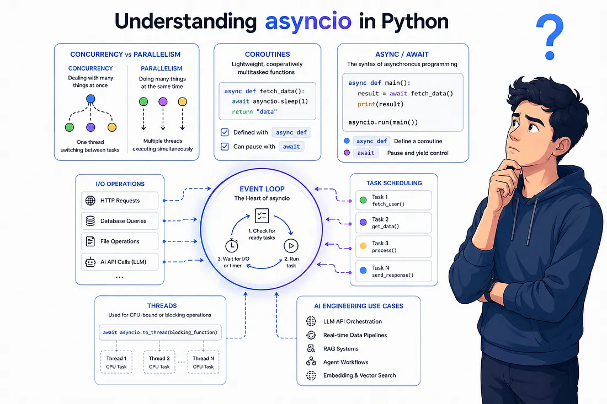
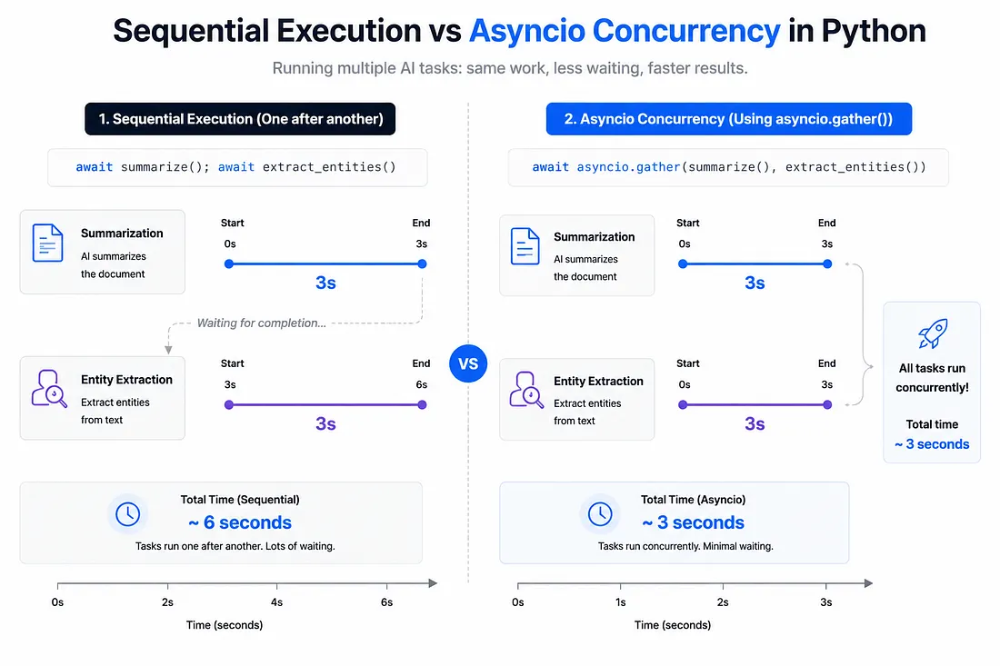

# Asyncio in AI Engineering: The Most Underrated Superpower in Python

> From `async/await` fundamentals to event loops, concurrency, and real AI engineering use cases, let's explore why `asyncio` has quietly become one of the most important concepts in modern AI systems.



## Introduction

We know the real superpower of `async/await`.

While one request sits idle waiting for a database query, an API response, or an LLM call, the server refuses to waste that time doing nothing. Instead, it immediately switches context and starts working on another user's request.

So even if `task2()` still waits for `task1()` inside the same flow, the application as a whole keeps moving—serving thousands of users concurrently on surprisingly few threads.

Modern AI systems spend an enormous amount of time waiting for responses, whether it's a simple LLM call, a vector database retrieval, or an external API request.

Let's explore how `asyncio` has quietly become one of the most powerful orchestration layers behind modern AI applications.

---



## Why Asyncio Matters

`asyncio` is one of the most powerful libraries in Python for building I/O-heavy systems.

While one task is waiting for a network call, the event loop instantly switches execution to another task, keeping the entire system moving efficiently.

What makes `asyncio` so underrated is that it solves a very real scalability problem without requiring threads everywhere.

Under the hood, `asyncio` achieves concurrency using:

* A **single thread** (smallest unit of execution within a process that allows a program to perform tasks concurrently).
* A **single event loop**  (scheduler behind asyncio which continuously checks in which task is ready to run, run it, pause it when it starts waiting and then switch to another task).
* Many **coroutines** (coroutines are functions that can temporarily stop using await , give control back to the event loop and resume later from the same point).
* **Cooperative task switching** through `await`.

Unlike `concurrent.futures` where concurrency is often achieved using multiple threads or processes managed by the operating system, asyncio works through lightweight coroutines managed entirely by the event loop itself. 

So whenever a task reaches a waiting state the event loop pauses that coroutine and immediately starts running another one allowing thousands of operations to progress concurrently without blocking the application.

---

## 1. Parallel LLM Calls with `asyncio.gather()`

Imagine performing tasks like summarization and entity extraction concurrently:

```python
results = await asyncio.gather(
    summarize(text),
    extract_entities(text)
)
```

Under the hood, each coroutine reaches a waiting state while the LLM processes the request.

Rather than blocking execution, the event loop immediately switches to another coroutine.

As a result, both operations progress together instead of linearly.

Since most LLM operations are heavily I/O-bound, `asyncio` allows these requests to overlap instead of waiting for each one sequentially, leading to significant latency improvements in modern AI pipelines.

> ⚠️ Remember: too many concurrent requests can overwhelm APIs and trigger rate limits.

---

## 2. Timeout Protection with `asyncio.wait_for()`

Modern AI systems often depend on unreliable or unpredictable external services.

An LLM API may slow down unexpectedly, a vector database might stall, or an external tool could hang entirely.

In production systems, you never want one slow operation to freeze the entire pipeline.

```python
response = await asyncio.wait_for(
    call_llm(),
    timeout=10
)
```

This acts as a fail-safe mechanism that prevents a single slow request from hanging your application.

This becomes especially important in:

* Agent workflows
* Retrieval systems
* LLM API latency management
* External tool execution

---

## 3. Background Tasks with `asyncio.create_task()`

Not every operation in an AI system needs to block the main execution flow.

Some tasks are important, but they should run independently in the background without delaying the user-facing response.

```python
asyncio.create_task(store_conversation_memory())
```

The coroutine is scheduled to run in the background while the main workflow continues immediately without waiting for completion.

This pattern is extremely useful in production AI systems where responsiveness matters.

For example, a chatbot can continue streaming responses to users while simultaneously:

* Logging analytics
* Storing conversation memory
* Updating caches
* Triggering monitoring pipelines

All of this can happen asynchronously in the background.

---

## 4. Preventing Event Loop Blocking with `asyncio.to_thread()`

While `asyncio` is excellent for I/O operations, AI workflows often involve CPU-bound tasks such as:

* Local text chunking
* Complex document parsing
* Embedding preprocessing
* Heavy data transformations

If a blocking synchronous function runs directly inside an async workflow, it can freeze the entire event loop and eliminate the benefits of concurrency.

```python
chunks = await asyncio.to_thread(
    heavy_chunking_function,
    text
)
```

By using `asyncio.to_thread()`, blocking CPU operations are offloaded to a separate thread.

This keeps the main event loop free to handle other asynchronous AI API calls efficiently.

---

## Conclusion

`asyncio` is not a magical performance hack that automatically makes systems faster.

For CPU-intensive workloads such as:

* Model training
* Heavy local inference
* Large numerical computations

`asyncio` may provide little or no benefit because the CPU is busy computing rather than waiting.

However, modern AI systems spend enormous amounts of time waiting:

* Waiting for LLM responses
* Waiting for vector database retrievals
* Waiting for embedding APIs
* Waiting for external tools
* Waiting for network I/O

And that is exactly where `asyncio` shines.

Its real superpower is making waiting efficient.

### Production Challenges

Concurrency introduces its own engineering complexities:

* API rate limits
* Hanging coroutines
* Connection exhaustion
* Blocking calls inside the event loop
* Difficult debugging scenarios

This is why production-grade AI systems often combine `asyncio` with:

* Concurrency limits
* Semaphores
* Retries
* Batching
* Timeout protection
* Structured orchestration layers

---

## Final Thoughts

Asyncio has become one of the foundational building blocks behind modern AI applications, agent systems, RAG pipelines, and orchestration frameworks.

Understanding how it works—and when to use it—can dramatically improve the scalability and responsiveness of AI systems.

I'd love to hear your thoughts and experiences with `asyncio`, especially how you see it evolving within modern AI engineering workflows and orchestration systems.
