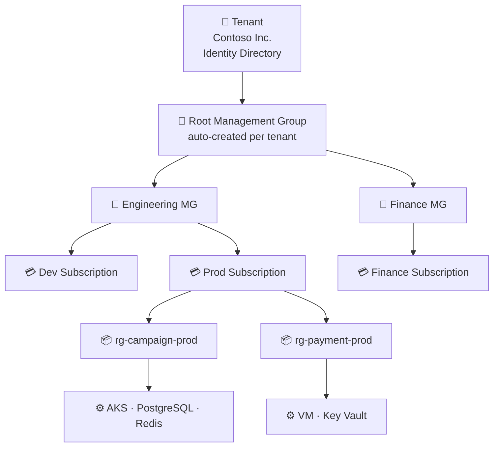
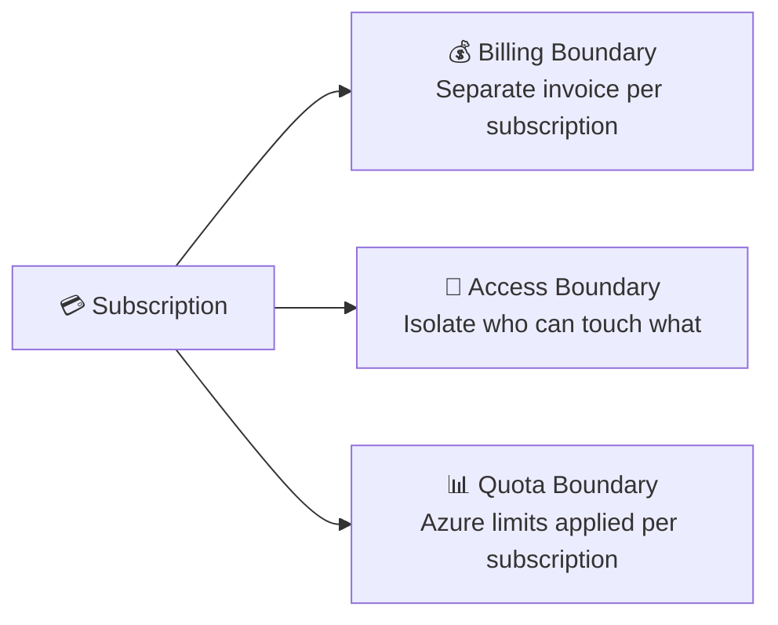
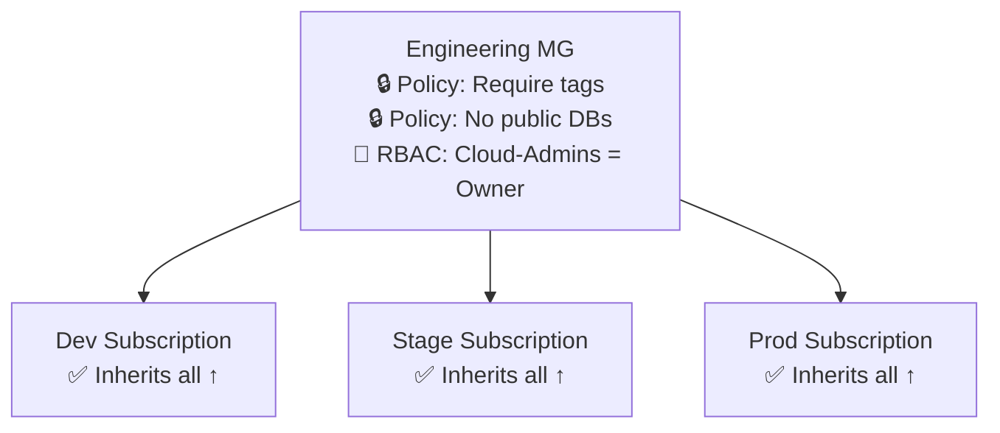
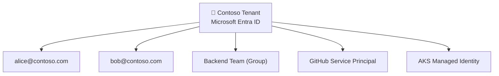
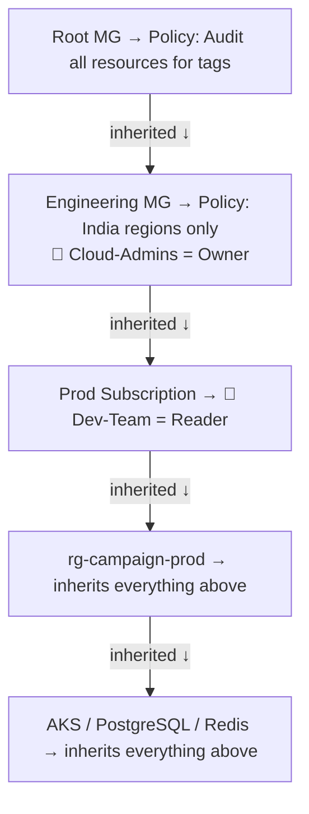

# Azure Hierarchy: Tenant → Management Group → Subscription → Resource Group → Resource

---

## The Full Picture



---

## One-Line Summary of Each Layer

| Layer | Mental Model | Handles |
|---|---|---|
| **Tenant** | Company Identity Database | Users, Groups, Apps, Service Principals |
| **Management Group** | Department/Division folder | Organises subscriptions; policy + RBAC inheritance |
| **Subscription** | Cloud Account | Billing, access, and quota boundary |
| **Resource Group** | Project Folder | Lifecycle grouping of related resources |
| **Resource** | Actual Infrastructure | VMs, DBs, AKS, Storage, etc. |

---

## Layer 1 — Resource

The actual billable Azure service you create.

```
aks-campaign-prod
postgres-campaign-prod
redis-campaign-prod
```

No magic here — this is the real thing.

---

## Layer 2 — Resource Group

A **logical folder** for resources that share the same lifecycle.

```
rg-campaign-prod
├── AKS
├── PostgreSQL
├── Redis
└── Key Vault
```

**Golden rule:** Group what gets deployed, managed, and deleted together.

**Hard rules:**
- A resource belongs to **exactly one** RG — no sharing
- RGs cannot be nested
- Deleting an RG **deletes everything** inside it
- RG location = metadata only; resources inside can be in any region

---

## Layer 3 — Subscription

Three boundaries in one:



**Why separate subscriptions per environment?**

If Dev and Prod share one subscription, a bad `terraform destroy` can wipe production.
Different subscription = **isolated blast radius**.

```
Dev Subscription   → Devs have Contributor
Prod Subscription  → Devs have Reader only
```

**Key limits per subscription:**

| Resource | Limit |
|---|---|
| Resource Groups | 980 |
| Virtual Networks | 1,000 |
| Role Assignments | 4,000 |

---

## Layer 4 — Management Group

A **folder for subscriptions**. Exists purely for governance at scale.

**The problem it solves:**

> You have 50 subscriptions. You want the same policy on all of them.
> Manually configuring each one is painful and error-prone.

**The solution:**



Assign policy once → all children inherit it automatically.

**Limits:**
- Max 6 nesting levels (excluding root)
- 10,000 management groups per tenant
- Each subscription belongs to exactly one MG at a time

---

## Layer 5 — Tenant (Most Misunderstood)

> **Tenant is NOT for organising resources. It's an identity directory.**



Tenant answers: **"Who are you?"**

Management Group answers: **"How are subscriptions organised?"**

These are two separate concerns. Tenant is the identity layer. MG is the resource organisation layer.

**Tenant ID** identifies the Entra directory — not any subscription, MG, or resource group.

---

## Inheritance Flow — Most Important Concept

Policies and RBAC always flow **downward**. Assign once at the top, every child inherits.



---

## Final Mental Model

```
Tenant          = Company Identity Database  →  Who are you?
Management Group = Department                →  How are subscriptions grouped?
Subscription    = Cloud Account              →  What's the billing & access scope?
Resource Group  = Project Folder             →  What belongs together?
Resource        = Actual Infrastructure      →  What are you running?
```
