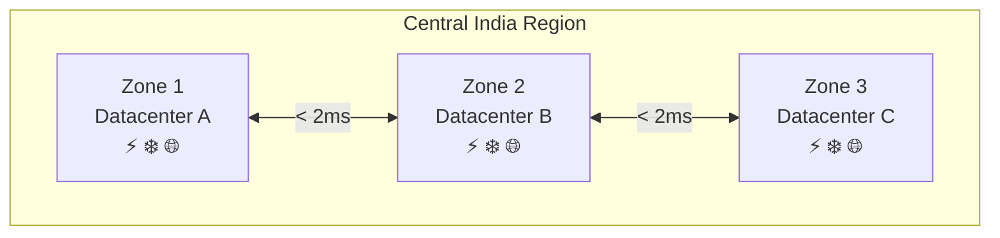
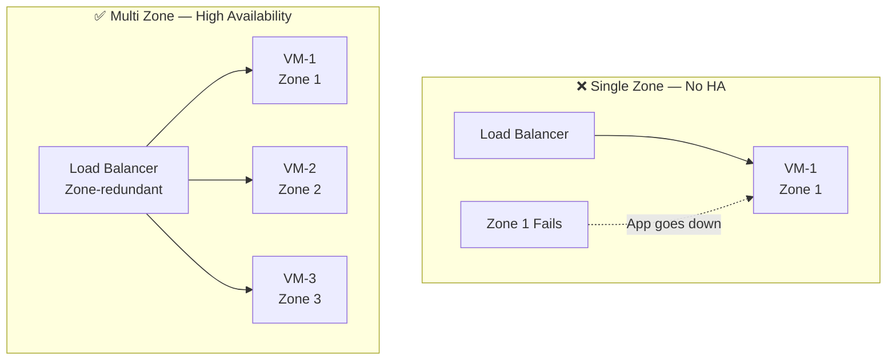
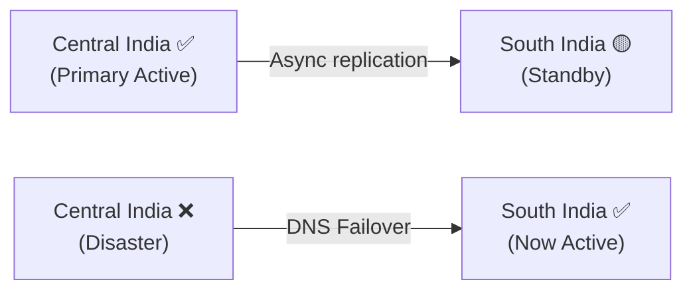

# Azure Global Infrastructure — Regions, Availability Zones & Region Pairs

---

## Why Regions Exist

If all Azure servers were in one country, every user elsewhere would face high latency, no fault isolation, and compliance risks. Microsoft solves this by distributing infrastructure globally into **Regions**.

---

## Region

> A **Region** is a geographical area containing one or more datacenters connected via a low-latency network. Azure has **60+ regions** worldwide.

**How to pick a region — 4 factors:**

| Factor | What to consider |
|---|---|
| **Latency** | Deploy close to your users |
| **Compliance** | Data residency laws (GDPR, DPDP, HIPAA) |
| **Cost** | Pricing varies by region — check Azure Pricing Calculator |
| **Service Availability** | Not every service is in every region |

---

## Availability Zones (AZ)

> An **AZ** is a physically separate, independent datacenter **within** a Region — with its own power, cooling, and networking.

Zones within a region are connected via private fibre. Microsoft's inter-zone latency target is **< 2 ms** (performance target, not a contractual SLA).



> Zone numbers are **logical, not physical** — "Zone 1" in your subscription may map to a different datacenter than another subscription's "Zone 1". This distributes load across facilities.

### Single-Zone vs Multi-Zone



**What AZs protect against:**

| Failure | Protected? |
|---|:---:|
| Single datacenter power/network/fire | ✅ |
| Entire region going down | ❌ |

---

## Region Pair

> A **Region Pair** is two Azure regions in the same geography linked for disaster recovery. Microsoft prefers ~300 miles (480 km) separation — but this is a guideline, not a hard rule.

| Primary | Paired |
|---|---|
| Central India | South India |
| East US | West US |
| North Europe | West Europe |

**Why it matters:**
- Microsoft never updates both regions in a pair simultaneously
- In a declared disaster, Azure prioritises recovering at least one region in each pair

**DR in practice:**



- **RTO** — how fast must the system recover?
- **RPO** — how much data loss is acceptable?

---

## AZ vs Region Pair — Quick Comparison

| | Availability Zone | Region Pair |
|---|---|---|
| **Protects against** | Datacenter failure | Regional failure |
| **Distance** | Within ~100 km | ~480 km (guideline) |
| **Latency** | < 2 ms | 20–100+ ms |
| **Failover** | Automatic (with LB) | Manual / Azure Site Recovery |
| **Use case** | High Availability | Disaster Recovery |
| **VM SLA** | 99.99% | Business continuity |

---

## Architecture Options

| Option | Setup | HA | DR | Cost |
|---|---|:---:|:---:|:---:|
| A | 1 VM · 1 Zone | ❌ | ❌ | $ |
| B | Multi-VM · Multi-Zone | ✅ | ❌ | $$ |
| C | Multi-Zone + Region Pair | ✅ | ✅ | $$$ |

> Production minimum = **Option B**. Mission-critical = **Option C**.

---

## Key Takeaways

```
Region           = Deployment location (60+ worldwide)
Availability Zone = Independent DC within a region → protects against DC failure
Region Pair      = Two regions linked for DR → protects against regional failure
```

- Deploy across **multiple zones** → high availability (up to 99.99% SLA)
- Use **region pairs** → disaster recovery
- Region choice affects latency, compliance, cost, and service availability
