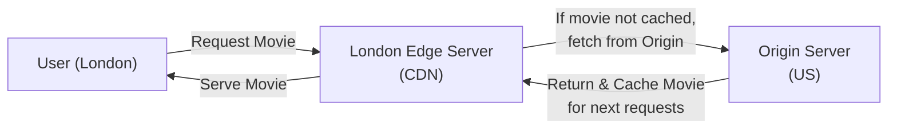

# Content Delivery Networks (CDNs)

## 1. The Core Problem

When building a global application, you cannot beat the speed of light. If your main server is located in New York, a user in Tokyo will experience a delay (latency) when trying to load a heavy image or video simply because the data has to physically travel across the ocean.

If your website is full of heavy **static assets** (images, videos and styling scripts that are exactly the same for every user), users far away from your server will experience a slow, frustrating application.

## 2. The Solution: What is a CDN?

A Content Delivery Network (CDN) is a large network of servers (bunch of distributed servers) all around the world. Instead of forcing every user to fetch data from your single main server, the CDN places copies of your files on servers in cities near your users (e.g., Tokyo, London, Sydney). It works by caching and serving content from an appropriate nearby server, reducing latency, load times and bandwidth costs.

## 3. How a CDN Works (Architecture Example)

Imagine a user in **London, UK** wants to watch a movie from a video platform whose origin infrastructure is located primarily in the **United States**.

1. **The Request (CDN Routing):** When the user clicks play, their browser performs a DNS lookup to find the movie. The CDN uses DNS, Anycast and other routing techniques to direct the user's request to an appropriate nearby **Edge Server** rather than sending every request directly to the Origin Server.
2. **Cache Miss (The First Request):** The London Edge Server checks its local storage. If it does not have the movie yet, it fetches it from the Origin Server. The Edge Server serves the movie to the user and **caches a copy** locally.
3. **Cache Hit (Subsequent Requests):** When a second user in London clicks play on the exact same movie, the request goes to the London Edge Server. Because the server already has the cached copy, it can serve the movie directly. The request does not need to reach the Origin Server, saving time and bandwidth.

## 4. Key Terminology

* **Origin Server**: The original, main server from which the CDN retrieves content. This could be your DigitalOcean droplets, AWS servers, or other origin infrastructure.
* **Edge Server (PoP - Point of Presence)**: The servers owned by the CDN provider (like Cloudflare or AWS CloudFront) that are physically located close to the end-users.
* **Static Content**: Files that do not change from user to user (e.g., logos, CSS files, YouTube videos). CDNs are designed to cache static content.
* **Dynamic Content**: Data that is unique to a specific user (e.g., your bank account balance, a live chat message). This is often not cached by default because it may be personalized or change frequently, although CDNs can cache certain dynamic responses when configured appropriately.
* **Cache Hit**: When a user requests an image, and the local Edge Server already has a copy saved. The image is served directly from the cache.
* **Cache Miss**: When a user requests an image, but the local Edge Server doesn't have it. The Edge Server must go ask the Origin Server for a copy. It then saves a copy for the next user.
* **TTL (Time to Live)**: An expiration timer you set on your files. If you set a TTL of 24 hours, the cached response becomes stale after 24 hours and the CDN may need to revalidate or fetch a fresh copy from the Origin Server. This helps ensure users don't see outdated content forever.
* **GeoDNS (Geographic DNS)**: A DNS-based routing technique that can use geographic information to direct users toward an appropriate CDN location. It is one of several techniques that can be used to route users to CDN Edge Servers.
* **Cache Invalidation**: The process of removing or marking cached content as outdated before its normal TTL expires. For example, if you update `logo.png`, you can purge the old cached version so users receive the new one sooner.

## 5. Why Use a CDN? (The 3 Big Benefits)

1. **Massive Speed Increase (Low Latency)**: Users download heavy files from a server near them rather than across the world.
2. **Reduced Load on Your Origin Server**: If a video goes viral, 1 million people might try to watch it. If you don't have a CDN, your Origin Server may become overloaded. With a CDN, a large portion of the traffic can be handled by Edge Servers, reducing the load on your main server and potentially reducing your hosting costs.
3. **Security (DDoS Protection)**: Because the CDN sits between the internet and your Origin Server, bad actors and botnets hit the massive, highly-defended CDN servers first. Companies like Cloudflare can automatically detect and block malicious traffic before it reaches your origin infrastructure.