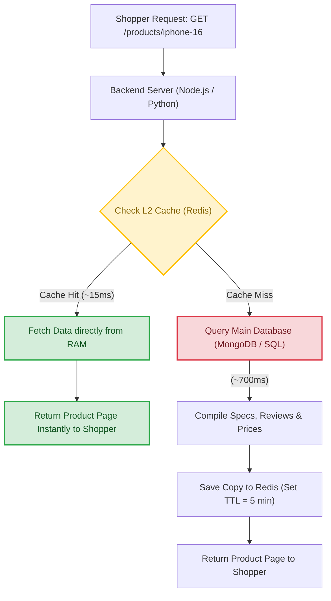
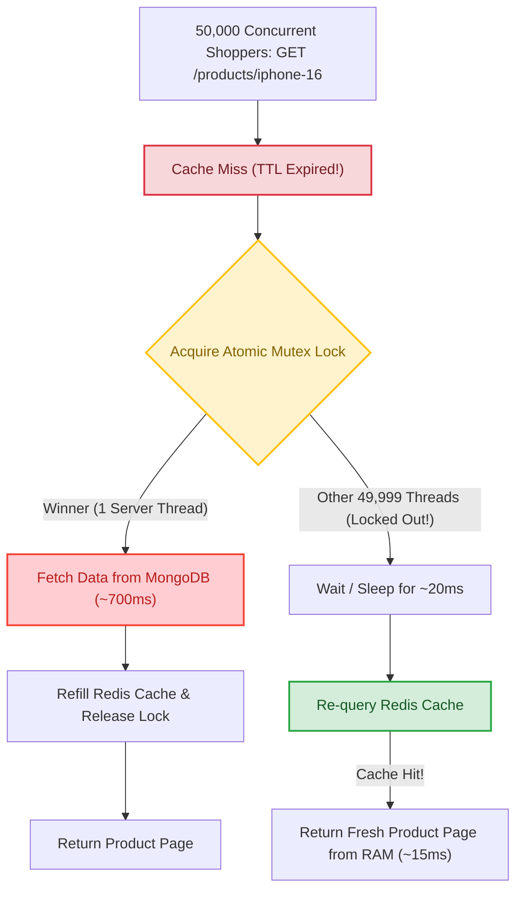

# Caching in System Design

## 1. What is Caching?

**Caching** is the process of taking data that is slow to fetch from a database (or expensive to compute in the backend) and storing a ready-to-use copy in a super-fast, high-speed temporary storage layer (such as **Redis** or **Memcached**) so that future requests can be served almost instantaneously.

### The E-Commerce Product Page Example (`/products/iphone-16`)
Imagine Apple has just released the brand-new iPhone 16, and **50,000 shoppers** are simultaneously visiting the product page on an online shopping store every single minute.

#### 1. Without Cache (The Slow Path)
When a shopper visits `/products/iphone-16`, the backend server must do heavy lifting:
* It queries the primary database (like MongoDB or PostgreSQL).
* It aggregates the full specifications, high-res photos, top 50 customer reviews, seller ratings, and applies pricing discount math.
* **Total Response Time: ~700ms**
  * *Result:* Users notice loading latency, and the database server struggles under the weight of 50,000 repeated heavy queries.

#### 2. With Cache (The Fast Path)
Since 99% of those 50,000 shoppers are looking at the exact same static iPhone specifications and imagery, there is no need to repeatedly strain the slow database.
* Once the backend server compiles the product page data the first time, it saves a copy directly into a lightning-fast **Redis Cache** in memory (RAM).
* The next 49,999 shoppers who visit `/products/iphone-16` grab the prepared data directly from Redis, completely bypassing the slower database!
* **Total Response Time: ~15ms** (~46x faster!)
  * *Result:* The product page opens instantaneously, dramatically improving customer experience and sales conversion.

#### High-Level Architecture Workflow (Cache Hit vs. Cache Miss)

---

## 2. Benefits of Caching

1. **Improved Performance (Speed):** Reduces application response times from fractions of a second (~700ms) down to just milliseconds (~15ms).
2. **Reduced Load (Database Shielding):** Protects primary databases from crashing under high concurrency during major viral spikes or flash sales.
3. **Cost Efficiency:** In-memory caching servers (like Redis) can handle tens of thousands of read requests per second on simpler hardware, reducing total cloud infrastructure bills.
4. **Scalability:** Easily enables web applications to absorb extreme, unpredictable traffic surges without performance degradation.

---

## 3. Types of Caches (Where Does the Cache Live?)

Caching functions as multiple lines of defense. The physically closer the cache sits to the end user, the faster the speed!

#### End-to-End System Design Caching Topology

```mermaid
flowchart LR
    subgraph ClientLayer ["1. Client Tier"]
        Client["Browser / Mobile App\n(Client Cache: 0ms)"]
    end
    
    subgraph EdgeLayer ["2. Edge / CDN Tier"]
        CDN["CDN / Cloudflare\n(Static Assets: ~15ms)"]
    end
    
    subgraph ServerLayer ["3. Application Tier"]
        L1["Backend App Server\n(L1 In-Memory Cache: ~0.1ms)"]
    end
    
    subgraph DataLayer ["4. Persistence & Cache Tier"]
        L2[("L2 Distributed Cache\nRedis Cluster: ~15ms")]
        DB[("Primary Database\nMongoDB / SQL: ~700ms")]
    end
    
    Client -->|"Step 1: Fetch static UI/Images"| CDN
    CDN -->|"Step 2: Forward dynamic API requests"| L1
    L1 -->|"Step 3: Check shared cache (if L1 miss)"| L2
    L2 -->|"Step 4: Fallback query (if L2 miss)"| DB
    
    style Client fill:#e3f2fd,stroke:#2196f3,stroke-width:2px,color:#0d47a1
    style CDN fill:#e0f7fa,stroke:#00bcd4,stroke-width:2px,color:#006064
    style L1 fill:#fff9c4,stroke:#fbc02d,stroke-width:2px,color:#f57f17
    style L2 fill:#c8e6c9,stroke:#4caf50,stroke-width:2px,color:#1b5e20
    style DB fill:#ffcdd2,stroke:#f44336,stroke-width:2px,color:#b71c1c
```

### 1. Client-Side Cache
* **Where:** Stored directly inside the buyer's web browser or mobile phone shopping app.
* **What it stores:** Website logos, fonts, CSS stylesheet themes, navigation icons.
* **Speed:** **0ms** (Data loads directly from the local device hardware without traversing the internet).

### 2. CDN Cache (Content Delivery Network)
* **Where:** Cloud edge servers scattered across hundreds of cities globally, physically near users' homes (e.g., AWS CloudFront, Cloudflare, Akamai).
* **What it stores:** Heavy static media like high-res iPhone marketing images, promotional unboxing videos, and large downloadable files.
* **Speed:** Extremely fast regional network fetches (~10-30ms).

### 3. Application-Level Cache (L1 Cache — In-Memory)
* **Where:** Embedded directly within the local memory (RAM) of your running backend server code (e.g., inside a Python dictionary, Node.js variable, or Java Guava cache).
* **Why it's called L1 (Level 1):** In system architecture, "Level 1" means *the closest and fastest storage possible*. Because the cache sits inside the server's own memory, there is **zero network latency**!
* **What it stores:** Frequently calculated mathematical formulas, product tax rates, or small configuration lists.
* **Speed:** Blazing fast application memory speed (~0.1ms).

### 4. Server-Side Cache (L2 Cache — Distributed)
* **Where:** Dedicated, high-speed centralized caching servers sitting across the internal datacenter network alongside your application—most notably **Redis** or **Memcached**.
* **Why it's called L2 (Level 2):** When a server checks its tiny local L1 memory and misses, it travels across the datacenter wire to check this bigger, shared "Level 2" Redis cluster. 
* **What it stores:** Compiled JSON API responses, expensive database query results, user shopping carts, and login sessions.
* **Speed:** Internal datacenter network speed (~1-15ms).

---

## 4. Cache Invalidation: The E-Commerce Dilemma!

When data is cached in Redis, what happens when the actual data in the main database changes? 

For example: Suppose a warehouse manager updates the database to **lower the iPhone 16 price from $999 to $899 for a Flash Sale**, or inventory drops to **Out of Stock**.
* If nothing is done, shoppers hitting `/products/iphone-16` will continue seeing the stale, outdated **$999** price coming out of Redis!
* Even worse, if the phone goes out of stock in the database, Redis might still report it as "In Stock," causing customer orders to fail at final checkout.

The process of removing or updating outdated information in the cache when source data changes is called **Cache Invalidation**.

> *"There are only two hard things in Computer Science: cache invalidation and naming things."*
> — Phil Karlton

Here are the two simplest, most reliable ways engineers solve Cache Invalidation:

### Approach 1: Time To Live (TTL — The Expiration Stopwatch)
We attach an automatic countdown timer to the item when saving it to Redis.
* When saving `/products/iphone-16` into Redis, we assign it a **TTL of 5 minutes** (300 seconds).
* As soon as the 5-minute stopwatch expires, Redis automatically erases the outdated page from memory.
* The very next shopper who opens the page causes the backend server to make a fresh trip to MongoDB, pick up the updated $899 price tag, and cache that brand-new price for the next 5 minutes!

### Approach 2: Active Deletion (Event-Driven Invalidation)
Instead of waiting around for a timer to run out (which could display wrong prices for up to 5 minutes during a live promotion), our backend application code proactively cleans the cache!
* Whenever an administrator clicks **"Update Price"** or warehouse stock drops to 0, our backend server executes two simple synchronized operations:
  1. Save the new price/stock into the primary database.
  2. Instantly execute `redis.delete('/products/iphone-16')` to erase the old copy!
* Because the stale cache is immediately removed, the next shopper searching for the iPhone is 100% guaranteed to trigger a clean database lookup and re-cache the live, authentic price!

---

## 5. Cache Reading & Writing Patterns

How should our backend application coordinate reading and updating data across two separate storage engines (fast RAM memory in Redis vs. slower disk persistence in MongoDB)?

### 1. Cache-Aside (Lazy Loading) — *The #1 Industry Standard*
* **Workflow:** The backend server actively controls all communication. When a shopper visits `/products/iphone-16`, the server checks Redis first. If found (Hit), return instantly. If not found (Miss), fetch from MongoDB and write a copy into Redis before returning.
* **Pros:** Only actively viewed pages consume expensive memory (no RAM wasted on unread products). If the Redis server crashes entirely, the website still functions gracefully via database fallback.
* **Cons:** A cache miss experiences slight delay because three distinct hops occur (query cache $\rightarrow$ query DB $\rightarrow$ write cache).

### 2. Write-Through Caching
* **Workflow:** When an administrator updates the iPhone 16 flash sale price to $899, our backend code updates **both** Redis and MongoDB simultaneously before replying "Price Updated successfully!".
* **Pros:** Perfect synchronization! Data inside Redis is completely immune to becoming outdated; shoppers never witness a stale price.
* **Cons:** Slower write operations, as every price change must wait for two distinct storages (fast RAM + slow disk) to confirm success.

### 3. Write-Back (Write-Behind) — *For Ultra-High Speed Ingestion*
* **Workflow:** When thousands of ecstatic shoppers furiously smash the "Add to Wishlist" or "Like" button during a product launch livestream, writing directly to MongoDB would overload disk bandwidth! Instead, our server writes modifications **only into Redis RAM** and instantly replies "Saved!". Redis batches these changes in memory and asynchronously dumps them to MongoDB in background intervals (e.g., every 5 seconds).
* **Pros:** Blazing write processing speed; handles millions of incoming button clicks per second effortlessly.
* **Cons:** **Risk of data loss!** If the Redis server suffers a sudden power blackout before the 5-second background sync fires, unwritten clicks vanish permanently.

---

## 6. Cache Eviction Policies (When RAM Floods to 100%)

Because physical RAM memory in servers is finite and costly compared to hard disks, caches eventually hit 100% capacity. How does a full Redis cluster decide which existing item to throw in the garbage to make room for newly arriving data?

### 1. LRU (Least Recently Used) — *The #1 Gold Standard*
* **Rule:** Evicts the item that has remained **untouched for the longest span of time** (e.g., an old 2018 iPhone charger page that nobody has viewed in three weeks).
* **Why engineers pick LRU:** Human behavior naturally follows temporal patterns—if a product page was recently opened, it has a high mathematical probability of being read again very soon!

### 2. LFU (Least Frequently Used)
* **Rule:** Tracks lifetime click volume on every item and evicts whatever has the **lowest historical total view count**.
* **Best For:** Stable datasets (such as country phone code lists or main shipping state catalogs) where long-term overall popularity matters far more than a momentary 5-minute traffic bump.

### 3. FIFO (First In, First Out)
* **Rule:** Functions like a basic checkout line: whichever item entered memory chronologically earliest gets dumped first, regardless of how popular it currently is. (Rarely used for production web caches).

---

## 7. Cache Stampede (The "Thundering Herd" Disaster)

In high-throughput systems, caches don't just speed up response times—they act as protective blast shields guarding sensitive relational or document databases. If a cache fails improperly, raw traffic floods directly into your database layer!

### The Cataclysm (What causes a Stampede?)
Imagine **50,000 shoppers** are actively browsing the trending iPhone 16 product page every second. 
At exact time $T=0$, the page's 5-minute **TTL countdown timer expires**, causing Redis to automatically erase the cached item!
In that precise split second, all **50,000 incoming user requests hit a Cache Miss simultaneously**. All 50,000 backend server threads bypass Redis at once and storm straight into MongoDB to execute the exact same heavy page computation. MongoDB's CPU jumps to 100%, connections saturate, and the entire database crashes offline!

### The Solution: Mutex Locking (Single-Flight Pattern)
When a cache miss occurs on a popular route, backend servers employ a decentralized atomic lock (in Redis via `SETNX — Set If Not Exists`). 
* Only **one** winning server thread is allowed to walk to MongoDB and calculate the product data!
* The remaining 49,999 competing threads are temporarily locked out and instructed to **pause for ~20ms**. When they re-check Redis 20ms later, they successfully grab the freshly warmed cache without ever touching the primary database!

#### Thundering Herd Mutex Lock Workflow

---

## 8. Cache Consistency & Invalidation Best Practices

Ensuring that transient cache data in Redis perfectly mirrors authoritative truth in MongoDB is difficult under high concurrency.
* **The Overwrite Race Condition:** If two warehouse managers update an inventory quantity at virtually the same millisecond, network latency bumps can cause MongoDB to commit Version B while Redis mistakenly finishes on an outdated Version A!
* **The Golden Rule (Invalidation over Modification):** When updating a database record, never try to recalculate and *overwrite* the existing string inside Redis. Always simply **DELETE (`DEL`)** the entire cache key! Deletion cleanly sidesteps concurrency timestamp clashes and forces the next shopper to cleanly trigger a fresh, authoritative Cache-Aside lookup.

---

## 9. Redis Clustering & Replication (Scaling the Cache Tier)

What happens when our caching workload becomes far too large or important for a single physical computer?

### 1. High Availability via Master-Slave Replication
If our entire store depends on one physical Redis server and its power supply fails, our caching defense collapses! 
To prevent single-point failures, engineers configure **Replication**: 
* **1 Primary (Master) Redis Server:** Absorbs all incoming write modifications and cache deletions.
* **2+ Standby (Replica/Slave) Redis Servers:** Continuously stream and copy every change from the Master in real time. If the Master machine crashes, automated tools instantly promote a replica to become the new primary without dropping offline!

### 2. Horizontal Scaling via Clustering & Consistent Hashing
Suppose an enterprise shopping platform catalog contains **500 million product SKUs** that exceed the memory footprint of a massive 64GB RAM computer. 
* We scale horizontally by splitting keys across a decentralized cluster of **10 or 20 independent Redis machines**! 
* How do web servers instantly know which of the 20 Redis computers is storing `/products/iphone-16`? By using **Consistent Hashing** on a circular virtual ring! Consistent Hashing allows us to add or remove Redis cluster nodes safely without triggering massive cache stampedes across our database!

---

## 10. Summary Cheat-Sheet & Core Vocabulary

| Term | Simple Beginner Definition |
| :--- | :--- |
| **Cache** | A temporary, ultra-fast memory storage layer (like **Redis**) designed to avoid slow database fetches. |
| **L1 Cache (Level 1)** | The fastest, closest memory layer! Sits directly inside the application server's local memory/RAM (~0.1ms) with zero network latency. |
| **L2 Cache (Level 2)** | A larger, shared distributed caching cluster (like **Redis**) accessed across the datacenter internal network (~15ms). |
| **Cache Hit** | The requested data was found inside the cache! Served instantly via the fast path (~15ms). |
| **Cache Miss** | The data wasn't in the cache; the server had to fall back to the slow database (~700ms) and re-save a copy. |
| **TTL (Time To Live)** | An automatic countdown timer telling Redis when to erase old cached items automatically. |
| **Cache Invalidation** | The required cleanup step of deleting or refreshing stale data inside the cache whenever database records are updated. |
| **Cache-Aside** | The standard read pattern: App checks cache first, on miss reads from database and saves a fresh copy to cache. |
| **Write-Through** | Updating the cache and the primary database simultaneously during a write operation for perfect consistency. |
| **Write-Back** | Writing updates rapidly straight into Redis RAM for instant speed, letting Redis sync down to the database in background intervals. |
| **LRU Eviction** | *Least Recently Used* — Throwing out whatever cached item hasn't been accessed for the longest span of time when RAM reaches 100% capacity. |
| **Cache Stampede** | Also known as **Thundering Herd**! A disastrous failure where a popular cache item expires and thousands of simultaneous requests storm the database at once. Solved via Mutex Locking! |
| **Redis Replication** | Creating replica backup servers of a master Redis instance to guarantee continuous uptime if hardware crashes. |
| **Redis Clustering** | Using **Consistent Hashing** to divide millions of cached items evenly across multiple separate physical Redis servers! |
| **Cache Hit Ratio** | The percentage of user requests successfully answered directly by the cache instead of hitting the database (e.g., a 95% ratio means 95 out of 100 queries are served super fast!).