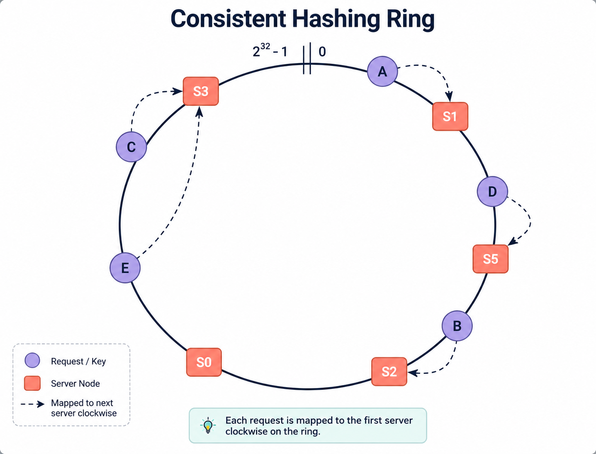

# Consistent Hashing

## 1. What is Consistent Hashing?

In large-scale distributed systems, user traffic and data are rarely stored on a single computer. Instead, data is spread across a cluster of multiple independent servers. To make this work, the system needs a reliable strategy to answer one core question: **Given a specific piece of data (or user request), which server should store or handle it?**

**Consistent Hashing** is a distributed routing technique that maps data keys to servers using a circular geometric model called a **Hash Ring**. 

Unlike traditional routing methods that depend on the total count of active servers, Consistent Hashing decouples the location of data from the total server count. As a result, when servers are added to or removed from a cluster, only a tiny fraction of data needs to be relocated, leaving the rest of the system completely undisturbed.

---

## 2. The Problem Before: Why We Need Consistent Hashing

To understand why Consistent Hashing is revolutionary, we must first examine the naive approach that came before it: **Modulo Hashing**.

### The Naive Approach: Modulo Hashing

In a standard system with $N$ active servers, the most straightforward way to route a request is to take the hash of a key (such as `user_id`) and compute the remainder when divided by the total number of servers $N$:

$$\text{Target Server} = \text{Hash}(\text{Key}) \mathbin{\%} N$$

If you have 3 servers ($N = 3$), the hash result modulo 3 will always produce an index of `0`, `1`, or `2`:
* `hash("user_101")` gives $105 \mathbin{\%} 3 = \text{Server 0}$
* `hash("user_205")` gives $208 \mathbin{\%} 3 = \text{Server 1}$
* `hash("user_309")` gives $311 \mathbin{\%} 3 = \text{Server 2}$

This works cleanly as long as the server count $N$ never changes.

### The Catastrophe When the Cluster Scales

In real-world applications, server counts change constantly due to traffic spikes, autoscaling, hardware failures, or scheduled maintenance. 

Suppose traffic increases and you add a 4th server to the cluster. Your server count changes from $N = 3$ to $N = 4$. Now, every single incoming request is evaluated using a new formula: $\text{Hash}(\text{Key}) \mathbin{\%} 4$.

Because the mathematical base of the modulo operator changed, almost every key's calculated server index shifts:
* `hash("user_101")` gives $105 \mathbin{\%} 4 = \text{Server 1}$ *(Was Server 0!)*
* `hash("user_205")` gives $208 \mathbin{\%} 4 = \text{Server 0}$ *(Was Server 1!)*
* `hash("user_309")` gives $311 \mathbin{\%} 4 = \text{Server 3}$ *(Was Server 2!)*

Mathematically, when scaling from $N$ to $N+1$ servers, the probability that a key stays on its original server is only $\frac{1}{N+1}$. This means that **$\frac{N}{N+1}$ of all keys (75% when moving from 3 to 4 servers) get remapped to completely different servers**.

### The Real-World Consequences

1. **For Distributed Caches (e.g., Redis Clusters)**: 
   75% of incoming user requests suddenly query servers that do not have their cached data. This causes a massive, cluster-wide **Cache Miss**. The web application falls back to querying the primary database for millions of requests simultaneously, overloading and crashing the database—a disaster known as a **Cache Stampede**.

2. **For Sharded Databases**:
   Queries for a user's data are routed to a database server that does not physically hold those database rows. The database returns an empty result, making user data appear to vanish from the application or causing cross-server data corruption when new writes land on the wrong database node.

---

## 3. How Consistent Hashing Works (Step-by-Step Analysis)

Consistent Hashing eliminates the dependency on the total server count $N$ by mapping both **Servers** and **Data Keys** onto a shared, circular number space.

### The Step-by-Step Algorithm

#### Step 1: The Hash Ring Range
A standard hash function (such as MD5 or SHA-1) outputs an integer within a fixed numerical range, typically between $0$ and $2^{32} - 1$ (which is $0$ to $4,294,967,295$). 

Instead of viewing this range as a linear line from left to right, imagine wrapping the number line into a circle where the maximum value ($2^{32} - 1$) connects back to $0$. This circle is called the **Hash Ring**.

#### Step 2: Mapping Servers onto the Ring
Next, we take each physical server in our cluster and calculate its hash position on the ring using its IP address or server hostname:

$$\text{Server Position} = \text{Hash}(\text{Server IP}) \mathbin{\%} 2^{32}$$

Each server receives a fixed coordinate on the circle. For example:
* Server 0 lands at position 30.
* Server 1 lands at position 120.
* Server 2 lands at position 240.

#### Step 3: Mapping Data Keys onto the Ring
When a user request arrives with a key (e.g., `user_id_99`), we pass that key through the **exact same hash function**:

$$\text{Key Position} = \text{Hash}(\text{Key}) \mathbin{\%} 2^{32}$$

This places the key at a specific coordinate on the exact same circular ring.

#### Step 4: The Clockwise Lookup Rule
To determine which server owns and serves a given key:
1. Start at the key's position on the ring.
2. Travel **clockwise** around the circle.
3. The **very first active server you encounter** is the designated owner of that key.

$$\text{Owner}(\text{Key}) = \min_{\text{Server}_i} \{ \text{Position}(\text{Server}_i) \mid \text{Position}(\text{Server}_i) \ge \text{Position}(\text{Key}) \}$$

If a key's position is located past the last server on the ring (for example, at position 300), you simply continue clockwise past the max value back to 0 and select the first server at the start of the ring (Server 0 at position 30).

---

## 4. Virtual Nodes (V-Nodes)

While basic 1-to-1 Consistent Hashing works in theory, placing only **1 spot per physical server** on the ring creates two major problems in real life:

### Problem 1: Uneven Load (The Hotspot Problem)

In Consistent Hashing, a server owns the segment of the ring from the **previous server (exclusive)** up to **itself (inclusive)** moving clockwise.

Imagine a circle with numbers from 0 to 100. Suppose we hash 3 physical servers, and by chance their hash positions land close to each other:
* **Server A** at position **10**
* **Server B** at position **20**
* **Server C** at position **30**

Now look at the actual ownership range for each server:
* **Server A** owns the interval $(30, 10]$, which wraps around the ring. This means it owns keys from 31–100 and then 0–10 *(80% of the ring!)*.
* **Server B** owns the interval $(10, 20] \rightarrow$ keys from 11–20 *(10% of the ring)*.
* **Server C** owns the interval $(20, 30] \rightarrow$ keys from 21–30 *(10% of the ring)*.

Because any key positioned between 31 and 100 travels clockwise past 0 to hit Server A at position 10 first, **Server A is forced to handle 80% of all incoming user requests**! Server A gets overloaded and crashes, while Server B and C sit mostly idle *(Hotspot / Uneven Load Distribution)*.

### Problem 2: The Chain-Reaction Crash (Cascading Failures)

Now suppose Server A gets overwhelmed and crashes.

What happens to Server A's 80% workload?
* By the clockwise rule, the next active server after Server A's position (10) is **Server B (at position 20)**.
* Server B now receives its own 10% traffic PLUS Server A's 80% traffic = **90% of all cluster traffic**!
* Server B gets crushed and crashes too.
* Now **Server C has to handle 100% of all traffic**, so Server C crashes too!

This chain reaction where one server crash overloads and kills every remaining server one by one is called a **Domino Crash (Cascading Failure)**.

---

### The Solution: Multiple Spots Per Server (Virtual Nodes / V-Nodes)

Instead of generating **1 single position** on the ring per physical machine, we generate **multiple mini positions (Virtual Nodes / V-Nodes)** scattered across the ring for each server. The exact number of virtual nodes per server is implementation-dependent (for example, 100, 128, or 256 virtual nodes per server).

#### How It Works:
One common implementation is to append a numeric index to the server's name before hashing:
* `Hash("Server_A_1")` $\rightarrow$ Position 15
* `Hash("Server_A_2")` $\rightarrow$ Position 48
* `Hash("Server_A_3")` $\rightarrow$ Position 112
* ...
* `Hash("Server_A_100")` $\rightarrow$ Position 95

Even though 100 spots are registered on the ring map, there is still **only 1 physical Server A machine**. All 100 spots point back to Server A.

> 💡 **Key Concept**: Notice that the lookup algorithm itself does not change. We still hash the key and move clockwise to the first node encountered. The only difference is that the ring now contains many virtual nodes instead of one position per physical server. Once a virtual node is selected, it simply forwards the request to its associated physical server.

#### Why This Fixes Both Problems:

1. **Fair Share (Hotspot Mitigation / Load Variance Reduction)**: With virtual nodes scattered across the ring, the circle is divided into many small interleaved segments, and **the distribution converges to nearly equal as the number of virtual nodes increases**.

2. **Safe Crashes (Cascading Failure Prevention)**: If a server fails, **the failed server's virtual nodes are distributed across many surviving servers because each virtual node has a different clockwise successor**. The extra load is spread across the entire cluster instead of crushing just one neighbor.

---

### How Many Virtual Nodes Are Used in Production?

There is no single fixed number. Production systems typically assign **dozens to hundreds of virtual nodes** per physical server (for example, Apache Cassandra uses 128 or 256 tokens per node by default). 

The exact count is chosen based on the desired balance between memory overhead and load distribution:
* **More Virtual Nodes**: Produces a much tighter, more even load distribution, but requires a larger routing table kept in memory.
* **Fewer Virtual Nodes**: Uses less memory overhead for the ring map, but increases the variance in load between servers.

> 💡 **Note on Memory**: This memory overhead is usually small compared to the benefits of improved load balancing.

---

## 5. Brainstorming Scenarios: Edge Cases & Mechanics

To appreciate the elegance of Consistent Hashing, let me trace what happens step-by-step during cluster changes and server failures.

### Scenario A: What Happens When a New Server Is Added?

Suppose our application traffic grows and we add a new server, **Server 3**, located at position 180 (which places it between Server 1 at 120 and Server 2 at 240).

#### How the Data Mapping Adjusts:
* **Keys between 0 and 120**: Start at their coordinate, travel clockwise, and still hit Server 1. **Unchanged.**
* **Keys between 181 and 240**: Start at their coordinate, travel clockwise, and still hit Server 2. **Unchanged.**
* **Keys between 121 and 180**: Previously, traveling clockwise from these coordinates would pass 180 and hit Server 2 at 240. Now, traveling clockwise hits the newly inserted **Server 3 at position 180**.

#### The Result:
Only the keys located in the specific slice of the ring between 120 and 180 are reassigned to Server 3. Every other key on the entire ring remains mapped to its original server. 

Instead of remapping 75% of the cluster, we only remap roughly $\frac{1}{N+1}$ of the total data!

---

### Scenario B: What Happens When an Existing Server Crashes or Is Removed?

Suppose **Server 1** (located at position 120) experiences a physical hardware failure and goes offline.

1. Server 1's coordinate (120) is removed from the ring.
2. Incoming requests for keys located between 30 and 120 start at their key position and travel clockwise.
3. Because Server 1 is no longer there, the search continues past 120 until it encounters the next active server on the ring: **Server 2 at position 240**.

#### The Result:
All keys that previously belonged to Server 1 automatically route to Server 2. 

Crucially, **keys belonging to Server 0 and Server 2 are completely unaffected**. Their clockwise path never included Server 1, so their routing remains 100% stable.

#### Does Server 2 actually have the data when traffic shifts to it?

It depends on whether you are using a **Cache** or a **Database**:

* **In a Distributed Cache (e.g., Redis Cluster)**:
  Server 2 does **NOT** have the data initially. When requests for Server 1's keys land on Server 2, Server 2 registers a **Cache Miss**, fetches the fresh data from the primary database, and stores it in Server 2's cache. Because only Server 1's keys experience a cache miss, 90%+ of the remaining cluster maintains a 100% cache hit rate.

* **In a Distributed Database (e.g., Apache Cassandra / Amazon DynamoDB)**:
  Server 2 **ALREADY HAS the data**! Distributed databases use **Replication (typically Replication Factor $R = 3$)**, which automatically copies every key to the next two clockwise servers when first written. Since Server 2 is Server 1's immediate clockwise neighbor, Server 2 already holds a live backup replica on disk, serving reads and writes instantly with zero downtime and zero data loss.