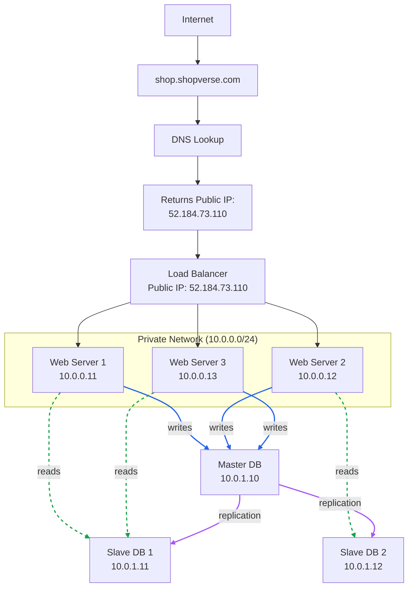

# Database Replication

Database Replication is the process of maintaining one or more copies (replicas) of a database on different servers to improve performance, availability, and reliability. A common replication architecture consists of a Primary (Master) database and one or more Replica (Slave) databases.

- **Primary (Master) DB** handles all write operations and can also serve reads when needed. In practice, applications route reads to replicas to reduce load on the primary.
- **Replica (Slave) DB** receives copies of the data from the Primary and typically serves read operations.

Most applications require a much higher ratio of reads to writes, so the number of replica databases is usually larger than the number of primary databases.

---

## Architecture Diagram

---

## Advantages of Database Replication

- **Better Performance:** All writes and updates go to the primary node. Read operations are distributed across replicas. More queries get processed in parallel, which improves overall performance.
- **Reliability:** If a database server is destroyed due to a natural disaster or hardware failure, data is still preserved. No need to worry about data loss because it's replicated across multiple locations.
- **High Availability:** Even if one database goes offline, the website continues to operate because you can access data stored in another database server.

---

## Synchronous vs. Asynchronous Replication

After the **Primary DB** processes a write request, it must synchronize the updated data with the **Replica DBs**. Depending on **when this synchronization happens**, replication is classified into two types.

### Synchronous Replication
The Primary DB waits for the Replica DB(s) to receive the updated data before confirming the write to the client. This ensures the replicas always have the latest data but increases write latency.

### Asynchronous Replication
The Primary DB confirms the write to the client immediately after storing it locally. The updated data is then synchronized with the Replica DB(s) in the background. This improves write performance but may cause **replication lag**, where replicas temporarily have stale data.

---

## What If a Database Goes Offline?

### Replica goes offline

When a replica becomes unavailable, the application's database router or load balancer redirects read traffic to the remaining healthy replicas. If it was the only replica, the primary temporarily handles both reads and writes until a replacement replica is provisioned and synced through replication.

### Primary goes offline

This is the trickier scenario. During a failover, a healthy replica is promoted to become the new primary — either automatically or manually, depending on the database and infrastructure setup. All database operations run through the newly promoted primary until the system stabilizes. A fresh replica is brought online as soon as possible to restore replication.

In production, this promotion isn't always clean. The replica being promoted may not have received every last write from the old primary before it went down. Any gaps in data typically need to be reconciled using recovery scripts or manual intervention.

---

## Replication Lag

Replicas don't receive changes instantly — there's always a small delay between when the primary processes a write and when the replica reflects it. Under normal conditions this lag is negligible, but during heavy load it can grow.

**Example:**
1. A user places an order — the write succeeds on the Primary.
2. The application immediately reads from a Replica to show the confirmation.
3. The order may not appear yet because replication is still catching up.

This is why replicas aren't always suitable for reads that need to reflect the absolute latest state.
