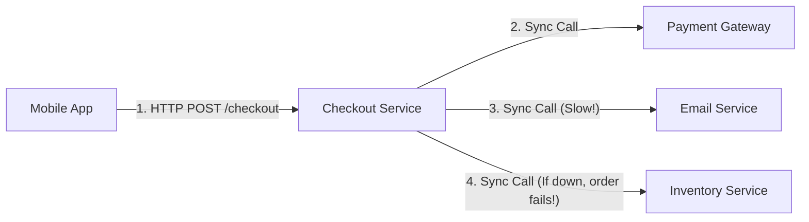
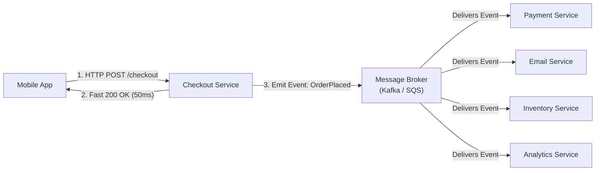
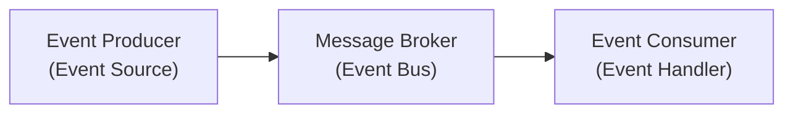

# Event-Driven Architecture (EDA)

In modern system design, **Event-Driven Architecture (EDA)** is an architectural pattern where software services communicate by emitting and reacting to **Events**, rather than calling each other directly.

---

## 1. What is an Event?

An **Event** is a record of a significant state change that has already happened in the system.

* Events are named in the **past tense**:
  * `OrderPlaced`
  * `UserRegistered`
  * `FileUploaded`
  * `PaymentProcessed`
* Events are immutable (they cannot be changed after they happen).

---

## 2. Synchronous (Request-Response) vs. Asynchronous (Event-Driven)

### 1. Synchronous Flow (Request-Response) — Tightly Coupled & Slow

### 2. Asynchronous Flow (Event-Driven) — Decoupled & Fast (50ms)

### Real-World Case Study: Placing an E-Commerce Order

#### Request-Response (Direct API Calls):
* **Blocking & Slow**: The Checkout Service must wait for Payment, Email, and Inventory services to finish sequentially before replying to the user (takes 3+ seconds).
* **Failure Cascades**: If the Email Service is experiencing a temporary outage, the user's entire order fails!
* **Tight Coupling**: Checkout Service must hardcode the URL endpoints and data schemas of all 3 downstream services.

#### Event-Driven Architecture (EDA):
* **Non-Blocking & Instant (50ms)**: Checkout Service saves the order, emits an `OrderPlaced` event to the Message Broker, and returns success to the user immediately.
* **Fault Tolerant**: If the Email Service crashes, the event sits safely in the Message Broker queue and gets processed as soon as the Email Service restarts.
* **Loose Coupling**: Checkout Service doesn't know or care who listens to `OrderPlaced`. Adding a new `Analytics Service` requires zero changes to the Checkout Service.

---

## 3. The 3 Core Building Blocks of EDA

1. **Event Producer (Event Source)**: The service that detects a state change and creates the event notification (e.g., Blob Storage when a file is uploaded, or Order Service when a checkout occurs).
2. **Message Broker (Event Bus)**: The middleware software (e.g., AWS SQS, AWS SNS, RabbitMQ, Kafka, Azure Storage Queue) that transports, stores, and routes event messages safely.
3. **Event Consumer (Event Handler)**: The service or worker script that receives the event and executes background business logic (e.g., resizing an image, sending a confirmation email).

---

## 4. Key Benefits of Event-Driven Architecture

1. **High Responsiveness & Fast User Experience**:
   * Users don't have to wait for heavy background tasks (like generating PDFs or sending emails) before getting a success response.
2. **Independent Scalability**:
   * If email traffic surges, you can scale *only* the Email Consumer service without touching the rest of your system.
3. **Easy Extensibility**:
   * Adding a new feature (e.g., an Fraud Detection service) is simple: just attach a new consumer to listen to existing events without modifying any producer code.

---

## 5. When to Use Event-Driven Architecture?

* **Background Processing**: Heavy jobs like video rendering, file imports, or report generation.
* **Multi-System Notifications**: When 1 action triggers actions across multiple microservices (e.g., checkout triggering billing, inventory, and shipping).
* **Handling Traffic Spikes**: Absorbing high write volume safely by queuing incoming requests so database nodes aren't overwhelmed.