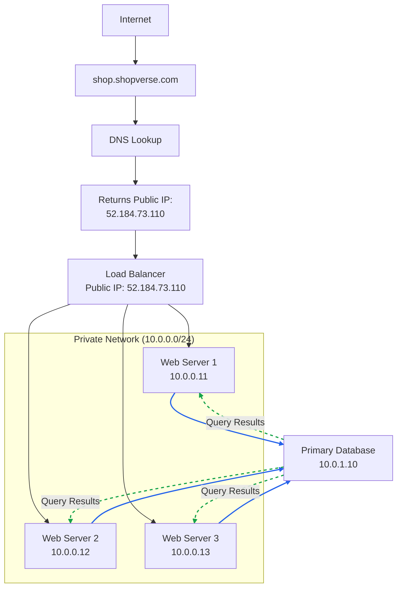

# Load Balancer — How It Works

## Overview

This document explains how a **Load Balancer** works in a typical multi-tier web application setup. We use `shop.shopverse.com` as an example throughout.

---

## Architecture Diagram

---

## Component Breakdown

### 1. How the Public IP & DNS Setup Works (Important — Students Often Miss This)

Before any user can visit `shop.shopverse.com`, two things must happen **in this order**:

1. **First, the Load Balancer is created** in the cloud (e.g., Azure, AWS). When you create a Load Balancer, the cloud provider **assigns it a public IP address** — in this case `52.184.73.110`. This IP is now live on the internet, but nobody knows about it yet.

2. **Then, you go to your DNS provider** (e.g., GoDaddy, Cloudflare, Route 53) and create a **DNS record** that maps your domain name to this IP:
   - **A Record:** `shop.shopverse.com` → `52.184.73.110`

Only **after** this DNS record is configured, when a user types `shop.shopverse.com`, DNS resolves it to `52.184.73.110` and the browser connects to the Load Balancer.

> **Key takeaway:** The public IP belongs to the Load Balancer, not to any individual web server. The domain is just a human-friendly name pointing to that IP via DNS.

---

### 2. Load Balancer

| Property | Value |
|---|---|
| **Public IP** | `52.184.73.110` |
| **Role** | Evenly distributes incoming traffic among web servers defined in the load-balanced set |

**How it works:**
- Users connect to the **public IP of the Load Balancer** directly. With this setup, web servers are **no longer reachable directly** by clients.
- The Load Balancer communicates with web servers using their **private IPs** (`10.0.0.11`, `10.0.0.12`, `10.0.0.13`).
- It evenly distributes incoming requests so that no single server gets overwhelmed.

**Failover (High Availability):**
- If Server 1 goes offline, all traffic is automatically routed to Server 2 and Server 3. This prevents the website from going down.
- By having multiple web servers, we solve the **no failover** problem — the site stays available even if a server fails.

**Scaling:**
- If traffic grows rapidly and the existing servers are not enough, the load balancer handles this gracefully — you simply **add more web servers to the pool**, and the load balancer automatically starts sending requests to them.

---

### 3. Web Server Tier (Private Network)

| Server | Private IP |
|---|---|
| Web Server 1 | `10.0.0.11` |
| Web Server 2 | `10.0.0.12` |
| Web Server 3 | `10.0.0.13` |

**Network:** `10.0.0.0/24` (Private subnet)

**Key Points:**
- All three servers sit inside a **private network** — they are **not directly reachable** from the internet. Users can only reach them through the Load Balancer.
- **Better security:** Since only private IPs are used for communication between servers, there is no way for an external attacker to directly target a web server.
- The `/24` subnet provides up to **254 usable addresses**, so more servers can be added as needed.
- Each server runs the same application code — they are stateless and interchangeable.

---

### 4. Database Tier

| Property | Value |
|---|---|
| **Role** | Primary Database |
| **Private IP** | `10.0.1.10` |
| **Subnet** | `10.0.1.0/24` (separate from web servers) |

**Key Points:**
- The database is on a **different subnet** (`10.0.1.x`) from the web servers (`10.0.0.x`), providing **network-level isolation**.
- All three web servers send queries to the **same primary database**.
- The database returns **query results** back to whichever web server made the request (shown as dashed green lines in the diagram).
- Being a single primary database, this is a potential **single point of failure** — production systems would typically add read replicas or a failover setup.

---

## Data Flow (Step-by-Step)

### Step 1 — DNS Resolution (UDP)
- User types `shop.shopverse.com` in the browser.
- The browser (via the OS) sends a **DNS query** to the configured DNS server. This is typically a **UDP** request on **port 53**.
- The DNS server looks up the A record and responds with `52.184.73.110`.
- Now the browser knows which IP to connect to.

### Step 2 — TCP 3-Way Handshake
Before any data can be sent, the browser must establish a **TCP connection** with the Load Balancer at `52.184.73.110` on **port 443** (HTTPS) or **port 80** (HTTP).

The TCP 3-way handshake (between **Client ↔ Load Balancer**):
1. **SYN** → Client sends a SYN (synchronize) packet to the **Load Balancer**.
2. **SYN-ACK** → Load Balancer responds with SYN-ACK (acknowledging the client's SYN and sending its own).
3. **ACK** → Client sends an ACK back. Connection is now **established**.

> The handshake happens with the Load Balancer, **not** the web servers — because web servers are on a private network and are not directly reachable from the internet. This ensures both sides are ready to communicate and agree on sequence numbers for reliable data transfer.

### Step 3 — TLS Handshake (for HTTPS)
If the connection is HTTPS (which it should be), a **TLS handshake** happens right after the TCP connection is established:
1. Client sends **ClientHello** (supported TLS versions, cipher suites).
2. Server responds with **ServerHello** + its **SSL/TLS certificate**.
3. Client verifies the certificate, both sides agree on encryption keys.
4. A **secure encrypted channel** is now established.

> After this, all data between the browser and Load Balancer is encrypted.

### Step 4 — HTTP Request
- The browser sends an **HTTP request** (e.g., `GET /products`) over the established TCP+TLS connection.
- This request arrives at the **Load Balancer** (`52.184.73.110`).

### Step 5 — Load Balancer Forwards to a Web Server
- The Load Balancer picks one of the web servers (e.g., `10.0.0.12`) based on its algorithm (round-robin, least connections, etc.).
- It forwards the request to the selected web server over the **private network** using the server's private IP.
- Note: The Load Balancer also establishes a TCP connection with the web server internally.

### Step 6 — Web Server Queries the Database
- The web server processes the request. If it needs data, it opens a **TCP connection** to the database at `10.0.1.10` (typically on port 3306 for MySQL, 5432 for PostgreSQL, etc.).
- It sends the SQL query and waits for the response.

### Step 7 — Response Travels Back
- The **Database** returns query results to the web server.
- The **Web Server** builds the HTTP response (HTML, JSON, etc.).
- The response travels back: Web Server → Load Balancer → Client's browser (over the same TCP+TLS connection).
- The browser renders the page.