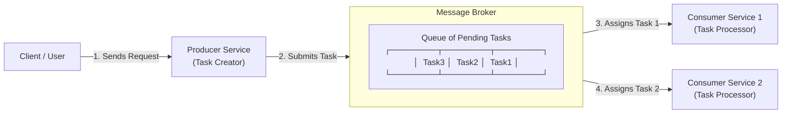
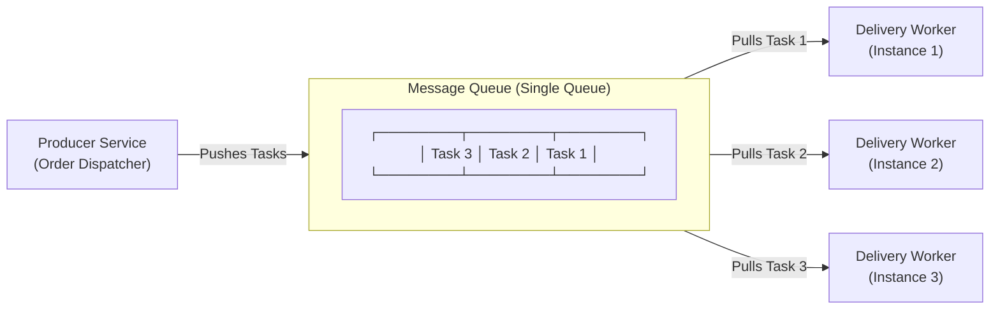
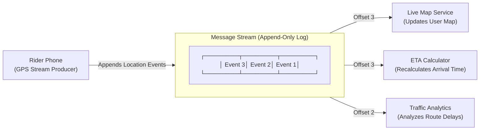

# Message Brokers

In distributed systems, a **Message Broker** is an intermediary software component (middleware) that enables different applications, microservices and devices to communicate with each other by exchanging messages.

---

## 1. What is a Message Broker?

Instead of a Producer service directly calling a Consumer service over the network, the Producer converts the user's request into a **Task** and hands it to the **Message Broker**. The broker holds the task in a queue until a Consumer service is ready to process it.

---

## 2. Why Do We Use a Message Broker?

Without a message broker, microservices rely on direct synchronous calls (like HTTP/REST). As a system grows, direct calls create bottlenecks, fragility, and tight coupling.

Here are the key reasons we use a Message Broker:

### 1. Decoupling (Loose Coupling)
* Producers (senders) and Consumers (receivers) do not need to know each other's IP addresses, network locations, or API contracts.
* You can modify, replace, or scale the consumer service without touching the producer service.

### 2. Asynchronous Processing (Non-Blocking)
* Producers don't waste time waiting for long background tasks to complete (like sending emails, processing videos, or generating PDFs).
* The producer hands the message to the broker and immediately responds to the user (e.g., returning a `200 OK` in 50 milliseconds).

### 3. Load Leveling & Traffic Spike Absorption
* During sudden traffic surges (e.g., Black Friday sales or flash promotions), thousands of requests can flood in at once.
* A Message Broker buffers these incoming messages in a queue, allowing consumer services to process them steadily at a safe, controlled pace without crashing the database.

### 4. Fault Tolerance & Resilience
* If a consumer service crashes or experiences a temporary outage, messages are **not lost**.
* The Message Broker holds the messages safely in persistent storage until the consumer service recovers and resumes processing.

### 5. Rate Limiting & Backpressure Control
* Consumers can pull messages from the broker at their own processing capacity (pull-based model), preventing downstream databases or third-party APIs from being overwhelmed.

---

## 3. Types of Message Brokers

Message Brokers generally fall into **two main architectural categories** based on their storage and consumption model:

### 1. Message Queues

A Message Queue is a data structure where a producer pushes tasks in from one end, and a consumer pulls tasks out to process from the other end.

The core intuition behind a message queue is that it is designed for **a single type of consumer service**. All workers listening to a queue are identical instances performing the exact same job, such as multiple scaling instances of a delivery assignment worker.

Because reading a message in a queue is a **destructive read** (the message is permanently deleted once processed), a single message can only ever be processed by **one single worker**. If different types of services—like an email service and an analytics service—listened to the same queue, they would end up stealing tasks from each other.

A classic real-world example is Swiggy's delivery assignment system, where a delivery assignment task for a new order is consumed by exactly one delivery assignment worker. That worker selects and assigns a delivery partner to the order.

Suppose a single worker is unable to process incoming tasks quickly enough, causing messages to accumulate in the queue. Instead of increasing the CPU or memory of that single server (vertical scaling), we can simply launch additional worker instances that listen to the same queue.

All worker instances are identical and compete for the next available message. Whenever a worker becomes idle, it immediately pulls the next task, processes it, and acknowledges successful completion. The message is then deleted from the queue, ensuring that no other worker processes the same task.

As traffic increases, more workers can be added. When traffic decreases, excess workers can be terminated. This allows the system to scale efficiently without changing the application logic.

### 2. Message Streams

To understand why message streams exist, we first need to look at the main limitation of traditional message queues.

In a message queue, reading a message is destructive—once a worker reads a task, that task is permanently deleted from the queue. This works great when only one type of worker needs to process a job. But what happens if multiple different services need to react to the exact same event?

Imagine a delivery rider's phone sending a location update. We want the live map service to update the user's screen, the ETA service to recalculate arrival time, and the analytics service to record traffic data. If we used a message queue, whichever service read the location update first would delete it, leaving the other two services with nothing.

This is why we need **Message Streams**.

Instead of deleting messages upon reading, a message stream keeps incoming events stored in a continuous, sequential log on disk for a set period of time (like 7 days). Because messages are never deleted when read, multiple completely different services can attach to the exact same stream and read the same events independently at their own speed.

Each service keeps track of how far it has read in the log using a personal bookmark called an **Offset** (checkpoint). For example, if the Live Map Service has read up to Event #50, its offset is 50; if the Analytics Service is slower and has read up to Event #30, its offset is 30.

This bookmark system also acts as a safety net: if a service crashes at Event #50 and restarts, it simply checks its last saved bookmark (#50) and resumes reading from Event #51 without losing data or repeating work. Moreover, if a bug occurs, developers can manually rewind the bookmark back to an earlier timestamp to re-read and re-process historical events.

A classic real-world example is Swiggy's live rider GPS tracking system. As a delivery partner drives towards a customer's location, their phone continuously emits GPS location updates (`RiderLocationUpdated`) to a message stream.

When data traffic becomes massive, a message stream scales horizontally by splitting the log into smaller chunks called **Partitions** spread across multiple servers. Consumer services form teams called **Consumer Groups** to divide the partitions among themselves and process heavy data streams in parallel. Common tools that implement message streams include **Apache Kafka**, **AWS Kinesis**, and **Azure Event Hubs**.

---

### 3. Summary

- **Choose a Message Queue (e.g., AWS SQS, RabbitMQ) when:**
  - You need task distribution among identical worker instances.
  - Each message represents a job that should be processed exactly once by a single worker.
  - Once processed successfully, the message can be deleted.
  - The primary goal is asynchronous processing, work distribution, and horizontal scaling.
  - *Example:* Processing background jobs, sending order emails, or assigning a Swiggy delivery driver.

- **Choose a Message Stream (e.g., Apache Kafka, AWS Kinesis) when:**
  - Multiple independent services need to consume the same events.
  - Messages should be retained for a configurable period instead of being deleted after reading.
  - Different consumer services should be able to process events independently at their own pace.
  - You need event replay, real-time streaming, or long-term event history.
  - *Example:* Live rider GPS tracking, real-time analytics, or financial transaction logs.