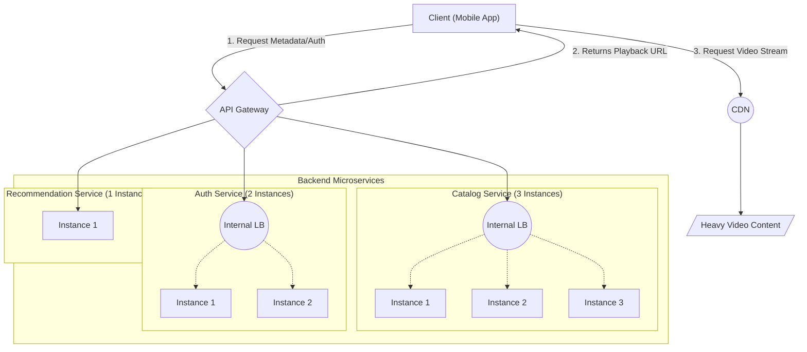

# Microservices vs. Monolithic Architecture

## 1. The Monolithic Architecture

A monolithic architecture is a traditional unified model for designing a software program. In this approach, all components of the application—such as user authentication, billing, background processing and business logic are interconnected, interdependent and deployed as a single unit.

* **Simplicity in Early Stages:** It is straightforward to develop, test and deploy a single application when a project is just beginning. Most startups start with a monolith and refactor to microservices later if needed (as the number of teams increases)
* **Performance:** Because all code runs within the same memory space, internal function calls are extremely fast. There is no network latency between different parts of the application.

### Challenges of a Monolith (At Scale)
* **Tightly Coupled Failure:** If a critical bug in one module causes the monolithic application process to crash, that instance can affect all functionality running within it.
* **Inefficient Scaling:** If one specific feature experiences heavy traffic, you cannot scale just that feature. You must deploy additional copies of the entire monolith, which consumes unnecessary computing resources.
* **Development Bottlenecks:** As the codebase grows, it becomes difficult for multiple engineering teams to work simultaneously without creating merge conflicts and breaking each other's code.

## 2. The Microservices Architecture

A microservices architecture breaks an application into independently deployable services, with each service responsible for a specific business capability.

### Core Principles
* **Independent Codebases:** The Authentication service and the Video Encoding service do not share the same codebase.
* **Independent Data Stores:** Each microservice must exclusively own its data. Other services should not directly access its database; they should interact through APIs or asynchronous events. This pattern ensures loose coupling, independent deployability, and fault isolation between services.
* **Decentralized Governance:** Teams can choose the best technology stack for their specific service (e.g., Python for an AI recommendation service, Go for a high-performance video streaming service).

### Advantages of Microservices
* **Fault Isolation:** Failure of one service doesn’t necessarily impact others. In a monolith, suppose critical bug in one module causes the monolithic application process to crash, the whole app crashes. In microservices architecture, if one service crashes the other services remain operational. For example, if the Recommendation Engine crashes, the core Video Streaming flow remains operational. Users can still watch movies.
* **Targeted Scaling:** If viewership spikes during a highly anticipated new movie release, you can allocate more resources specifically to the Video Catalog or other high-traffic services without scaling the entire application.
* **Team Autonomy:** Independent teams can update and deploy their specific services without waiting for the entire application release, also they have flexibility to choose their own tech stack.

## 3. How Clients Request in a Microservices Architecture

In a Video Streaming app, the Auth Service, the Recommendation Service, the Video Catalog Service and many more are independently deployed and may run on different machines or containers. 
If the mobile app talked directly to individual services, it would need to know how to locate each service and would become tightly coupled to the backend architecture. Furthermore, the mobile app would have to make multiple network requests to different backend services, increasing latency.

**The Solution: The API Gateway**
To solve this, we place an **API Gateway** in front of the microservices. The API Gateway acts as the single "Front Desk" for the entire backend. 
1. The mobile app only needs to know **one** public API endpoint (for example, `api.example.com`).
2. The mobile app makes a single request: "Load my homepage."
3. The API Gateway intercepts that request and securely routes it to the appropriate internal service. Alternatively, using a pattern called **API Composition**, it can fetch data from multiple services in parallel, stitch the data together and send one tidy package back to the mobile app.

**Scaling & Internal Load Balancing**
You can scale each service independently based on traffic. For example, suppose the video catalog service gets heavy traffic and requires 3 instances, the auth service requires 2 instances, and the recommendation service is sufficient with 1 instance. 
Service discovery and internal load balancing allow requests to be routed to healthy instances of each service.

**The Complete Architecture Flow**

Here is how a request flows from a user's phone through a scaled microservices backend:

