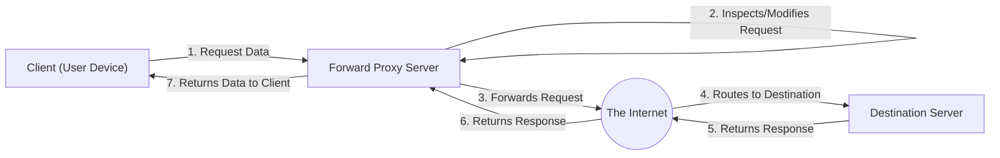
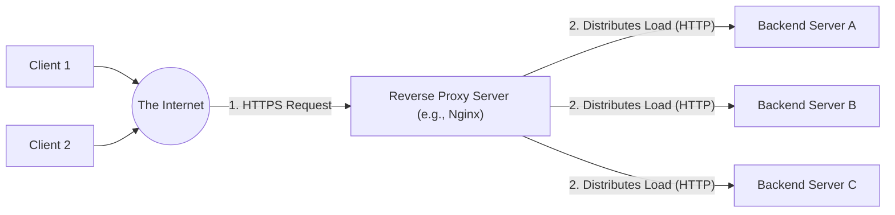

# Proxies: Forward vs. Reverse

At its core, a **Proxy** is an intermediary server. It acts as a middleman that sits between a **Requester** (which could be a user's laptop, or even an internal microservice) and a **Destination** (the final server hosting the data). 

Instead of the requester talking directly to the destination, all traffic flows through the proxy. The proxy intercepts the traffic and has the power to inspect it, modify it, cache it, or block it entirely.

In system design, proxies are split into two completely different concepts depending on *who* they are protecting: the client (the requester), or the server (the destination).

---

## 1. The Forward Proxy (Protects the Client)

**Definition:** A Forward Proxy is an intermediary server that talks to the internet *on behalf of the client*. It sits directly in front of the user's machine. When the user tries to access a website, the request goes to the Forward Proxy first, which then fetches the data from the internet and returns it to the user.

### Why do we need it?
* **Corporate Monitoring & Filtering:** Companies route all employee web traffic through a cloud-based forward proxy to monitor network logs, inspect for malware and block requests that violate company policy.
* **Anonymity & Privacy (VPNs):** When you use a personal VPN, you are using a forward proxy to hide your actual IP address from the destination server.
* **Bypassing Geo-Restrictions:** Routing your traffic through a forward proxy located in a different country to trick the destination server into thinking you are located there (e.g., accessing region-locked streaming content).
* **Bandwidth Caching:** If 1,000 employees on a corporate network try to download the exact same 5GB Apple iOS update, the proxy fetches it once from the internet, caches it, and serves the cached copy to the other 999 employees instantly, saving massive amounts of network bandwidth.

### High-Level Architecture Flow

A generic request flowing through a Forward Proxy:

---

## 2. The Reverse Proxy (Protects the Server)

**Definition:** A Reverse Proxy is an intermediary server that talks to the internet *on behalf of your backend servers*. It sits directly in front of your internal architecture. When a user tries to access your website, they do not connect to your backend server—they connect to the Reverse Proxy. The proxy then forwards the request to your internal servers, gets the response, and hands it back to the user. To the outside internet, the proxy *is* the web server.

*(Popular Reverse Proxies: Nginx, HAProxy, Envoy, Cloudflare).*

### Why do we need it?
* **Security & Isolation:** It hides your internal backend IP addresses, making it significantly harder for attackers to target your application servers directly.
* **Load Balancing:** It acts as a traffic router. If you have 10,000 incoming requests and 5 backend servers, the reverse proxy distributes the traffic evenly so no single server crashes.
* **SSL Termination:** Decrypting HTTPS traffic is CPU-intensive. Instead of making your backend servers do this heavy lifting, the Reverse Proxy decrypts the SSL certificates at the front door, and passes plain HTTP to your backend servers over a secure, private internal network.
* **Caching:** It can cache static content (like images, CSS, or common API responses). When a user requests the homepage, the proxy returns the cached version instantly without ever waking up your backend application or database.

### High-Level Architecture Flow

A generic request flowing through a Reverse Proxy:

