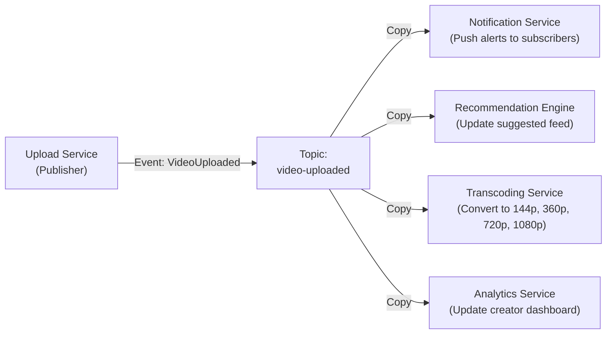

# Publish–Subscribe (Pub/Sub) Architecture

In distributed systems, **Publish–Subscribe (Pub/Sub)** is a messaging pattern designed for **one-to-many communication (Fan-Out)**. Instead of sending messages directly to multiple services, a publisher sends a single message to a central broker. The broker then automatically distributes a copy of that message to every subscriber interested in that topic. Although a real-world Pub/Sub system may have multiple publishers and multiple subscribers, each published message is broadcast from one publisher to all subscribers interested in that topic.

The core idea behind Pub/Sub is **decoupling**. Publishers do not need to know which services are consuming their messages, and subscribers do not need to know who produced them. Both communicate only through a shared **Topic**, making the system easier to scale and extend.

## 1. How Pub/Sub Works — The YouTube Example

Think of a **YouTube channel**.

When a creator uploads a new video, they don't manually send emails or messages to every viewer. They simply publish the video to their channel. Anyone who has subscribed to that channel automatically receives a notification about the new upload. The creator doesn't know who the subscribers are, how many there are, or whether new subscribers join tomorrow. YouTube takes care of delivering the notification to all subscribers.

This is exactly how Pub/Sub works in a software system. There are **three core components**:

1. **Publisher** — The service that creates and emits an event. In YouTube's case, this is the **Upload Service** that processes the creator's new video.
2. **Topic** — A named communication channel inside the message broker. Publishers publish messages to a topic, and subscribers subscribe to that topic to receive every published message. In the YouTube analogy, the topic is the creator's channel (e.g., `video-uploaded`).
3. **Subscriber** — Any service that registers interest in a topic and receives a copy of every event published to it.

The defining feature of Pub/Sub is **Fan-Out** — a single published event is automatically broadcast to multiple independent subscribers.

When a creator uploads a video, the Upload Service publishes a single **VideoUploaded** event to the `video-uploaded` topic. The broker then fans out copies of that event to multiple independent services — one sends push notifications to subscribers, another kicks off video transcoding into multiple resolutions, another updates the recommendation feed, and another logs it for the creator's analytics dashboard.

The Upload Service doesn't know or care how many downstream services exist. If YouTube's team adds a new **Content Moderation Service** tomorrow, they just subscribe it to the same topic — zero changes to the Upload Service. This is the power of **loose coupling** — publishers and subscribers evolve independently without needing direct knowledge of one another.
---

## 2. Traditional Pub/Sub

A **traditional Pub/Sub broker** is designed for **real-time message broadcasting**.

When a publisher sends a message:

1. The broker immediately forwards a copy to every active subscriber.
2. Once the message has been delivered, the broker typically discards it instead of storing it permanently.

Because messages are not retained, subscribers must be online at the moment the message is published. If a subscriber is temporarily unavailable, it misses the message permanently.

This model is ideal for scenarios where only **currently active subscribers** need to receive updates.

**Examples:**

* Live chat notifications
* Multiplayer game updates
* Real-time dashboards
* Redis Pub/Sub
* AWS SNS

---

## 3. Message Streams

As distributed systems became larger and more fault-tolerant, a limitation of traditional Pub/Sub became apparent: if a subscriber crashed or was temporarily offline, any messages published during that time were permanently lost.

To overcome this limitation, modern messaging platforms introduced **Message Streams**. Message Streams implement the same one-to-many Publish–Subscribe communication model while adding **durable storage**, **replayability**, **consumer offsets**, and **fault tolerance**.

Instead of discarding messages immediately after delivery, the broker stores every event in an **append-only log** for a configurable retention period.

Each subscriber (or consumer group) maintains its own **offset**, allowing it to track how far it has processed the stream.

This enables subscribers to:

* Read events at their own pace.
* Recover after crashes.
* Replay historical events.
* Process the same stream independently without affecting other subscribers.

Although the communication model is still **one publisher to many subscribers**, the key difference is that events are **persisted** instead of being discarded immediately.

Examples include:

* Apache Kafka
* AWS Kinesis
* Redis Streams

---

## 4. Popular Pub/Sub Technologies

### Traditional Pub/Sub

* **AWS SNS (Simple Notification Service)** – Cloud-native push-based Pub/Sub service.
* **Redis Pub/Sub** – Lightweight in-memory Pub/Sub for real-time messaging.

### Message Streams

* **Apache Kafka** – Distributed event streaming platform with durable storage and replay.
* **AWS Kinesis** – Managed real-time data streaming platform.
* **Redis Streams** – Persistent streaming data structure built into Redis.
* **Azure Event Hubs** – High-throughput event ingestion and streaming platform.