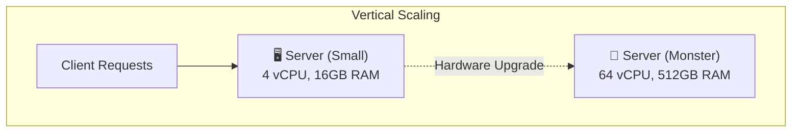
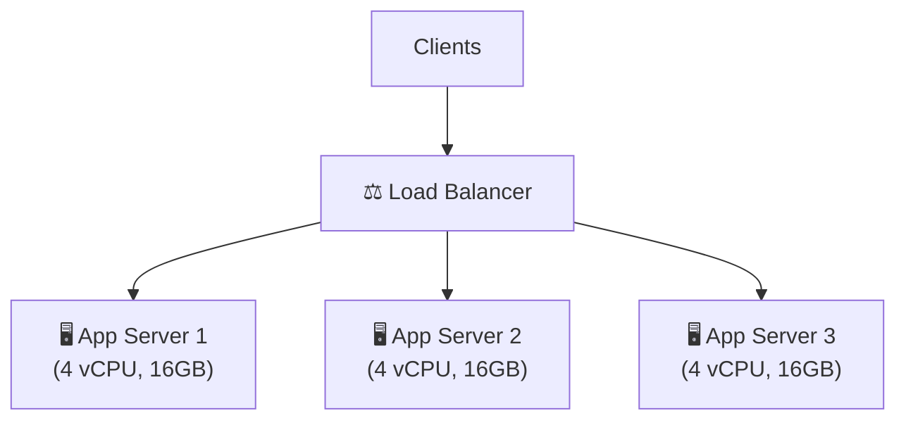
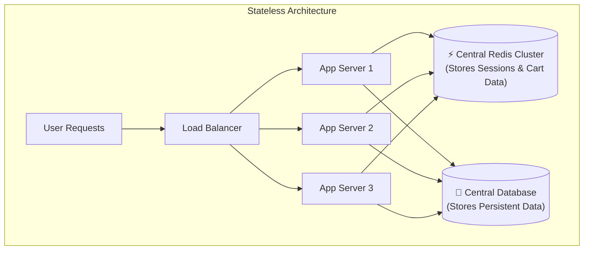
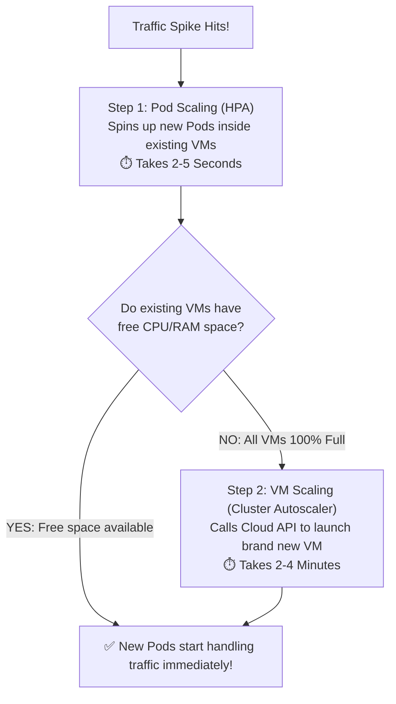
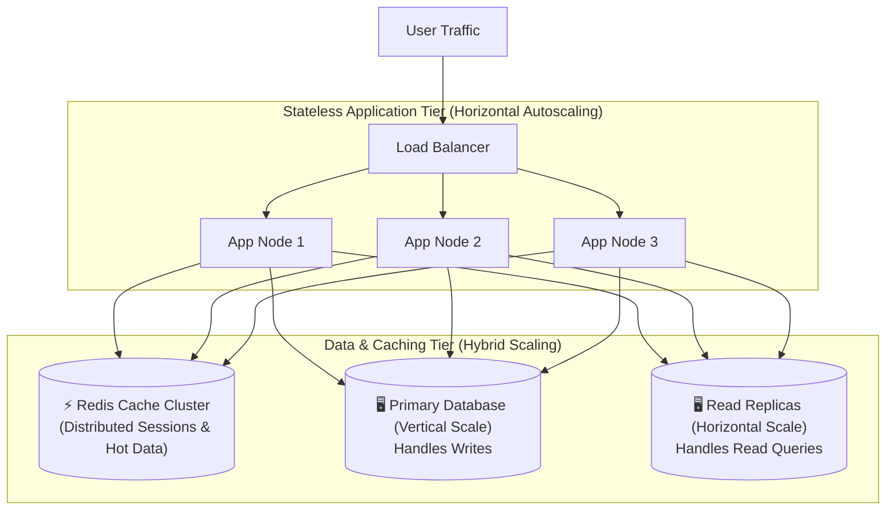

# Beginner's Guide to System Scaling: Vertical vs. Horizontal Scaling

## 1. What is System Scaling?

**System Scaling** is the ability of an architecture to handle growing workloads, higher traffic, or increasing data volume by adding computing resources.

When an application grows from **1,000 requests/day** to **100,000 requests/second**, a single default server will quickly run out of CPU, RAM, or network bandwidth, causing slow response times or complete system crashes.

---

## 2. Vertical Scaling (Scale-Up)

**Vertical Scaling** means upgrading the physical hardware resources of an **existing single server**—adding a faster CPU, more RAM, larger NVMe SSD storage, or dedicated GPUs.

### Real-Life Analogy
Upgrading your 2-seater hatchback car engine and frame into a giant custom monster truck. You still have **one vehicle**, but it is vastly more powerful.

### Pros
* **Simplicity**: No changes required to application code or architecture.
* **No Distributed System Complexity**: Zero network latency between services; no load balancer or service discovery needed.
* **Easy Data Consistency**: Database transactions (ACID guarantees) stay straightforward on a single machine.

### Cons
* **Hardware Ceiling**: Every machine has physical limits (RAM slots, CPU sockets). You will eventually hit a hard limit.
* **Single Point of Failure (SPOF)**: If the single server crashes, your entire application goes offline ($0\%$ availability).
* **Downtime During Upgrades**: Replacing physical RAM or CPU often requires shutting down the machine.
* **Exponential Cost Curve**: High-end enterprise servers become exponentially expensive compared to standard hardware.

---

## 3. Horizontal Scaling (Scale-Out)

**Horizontal Scaling** means adding **more physical or virtual servers (nodes)** to your pool of resources. Instead of making one server larger, you distribute incoming user traffic across multiple commodity servers using a **Load Balancer**.

### Real-Life Analogy
Instead of buying one giant super-truck, you hire a fleet of 10 delivery drivers on standard scooters. If delivery demand doubles, you simply hire 10 more drivers.

### Pros
* **Near-Unlimited Scaling**: Keep adding more server instances as traffic grows.
* **High Availability & Fault Tolerance**: If Server 2 crashes, the Load Balancer routes traffic to Server 1 and Server 3 seamlessly.
* **Linear Cost Efficiency**: Uses standard commodity hardware or cloud instances (AWS EC2, Docker containers).
* **Zero-Downtime Deployments**: Update application code one server at a time (Rolling Deployments).

### Cons
* **Increased System Complexity**: Requires load balancers, service discovery, and central caching.
* **Stateless Requirement**: Application servers must not store session state in local RAM memory.
* **Distributed Data Challenges**: Managing database consistency across multiple nodes requires handling the CAP theorem and eventual consistency.

---

## 4. The Golden Rule of Horizontal Scaling: Stateless Servers

To scale app servers horizontally, they **MUST be Stateless**.

* **Stateful Server (Problem)**: Stores user session/cart data in its own local RAM. If Server 1 dies or the user gets routed to Server 2, their cart is lost!
* **Stateless Server (Solution)**: App servers hold **zero session memory locally**. Any server can handle any request from any user at any second.

### How State is Handled in Scaled Systems

1. **Centralized In-Memory Store (Redis / Memcached)**:
   * App servers read/write user session data to an ultra-fast Redis cluster ($<1\text{ms}$ lookup).
   * If Server 1 dies, Server 2 retrieves the user's session from Redis instantly.
2. **Client-Side Tokens (JWT - JSON Web Tokens)**:
   * Encrypted user data is stored inside a cryptographically signed token on the user's browser.
   * On every request, any app server can cryptographically verify the JWT without querying a database.
3. **Sticky Sessions (Load Balancer Affinity - Sub-optimal)**:
   * The Load Balancer forces a specific user to stick to Server 1.
   * *Drawback*: If Server 1 crashes, the user still loses their session state.

---

## 5. Dynamic Autoscaling: Handling Variable Traffic

Traffic is rarely constant. A food delivery app receives heavy traffic during lunch (12 PM – 2 PM) and dinner (7 PM – 10 PM), but very little traffic at 3 AM.

### The Cost vs. Capacity Dilemma
* **Keeping Max Capacity (e.g. 50 servers) 24/7**: System never crashes, but you waste thousands of dollars paying for idle servers at night.
* **Keeping Low Capacity (e.g. 2 servers) 24/7**: Saves money, but the system crashes instantly during a traffic spike.

**Autoscaling** solves this by dynamically adding servers (**Scale-Out**) during high traffic and removing them (**Scale-In**) during low traffic.

### Real-Life Analogy
Supermarket checkout counters. On a busy Sunday afternoon, management opens 12 checkout lanes to clear long lines. On a quiet Tuesday morning, only 2 lanes stay open so staff aren't standing around idle.

### How Autoscaling is Implemented in Real Life

#### 1. Metric-Based Triggers
Autoscalers monitor real-time system metrics:
* **CPU / Memory Utilization**: Trigger scale-out when average CPU across servers exceeds $70\%$.
* **Request Count Per Target (RPS)**: Scale out when requests per instance exceed $500\text{ req/sec}$.
* **Queue Depth**: For worker nodes, scale up when unconsumed messages in a queue (e.g. AWS SQS, RabbitMQ) grow.

#### 2. Target Tracking Scaling Algorithm
Tools like **Kubernetes HPA (Horizontal Pod Autoscaler)** calculate the required instances using a simple ratio formula:

$$\text{Desired Replicas} = \left\lceil \text{Current Replicas} \times \frac{\text{Current Metric Value}}{\text{Target Metric Value}} \right\rceil$$

*Example*: If your target CPU is $50\%$, and 4 running pods jump to an average CPU of $80\%$:
$$\text{Desired Replicas} = \left\lceil 4 \times \frac{80}{50} \right\rceil = \lceil 6.4 \rceil = 7 \text{ Pods}$$

#### 3. Cooldown & Stabilization Window (Preventing Flapping)
To stop a system from spinning up and shutting down servers every few seconds due to tiny traffic hiccups (called **flapping**), autoscalers enforce a **Cooldown Period** (e.g. 3–5 minutes) after scaling before making another adjustment.

---

### 4. Deep-Dive: Two-Tiered Autoscaling (Pods vs. Servers)

To understand real-world cloud scaling, you must understand the distinction between **Pods** and **Servers (VMs)**:

* **Pod (Software Container)**: This is your actual application running in memory (e.g., a single `node server.js` process). It is lightweight and takes **2 to 5 seconds** to launch, it is like a mini virtual sandbox inside the server. **Think of it as a single worker**.
* **Server / VM (Hardware Machine)**: This is the underlying physical cloud machine (e.g., an AWS EC2 instance with 16 vCPUs and 64GB RAM) that provides the physical raw power to host multiple Pods. It takes **2 to 4 minutes** to boot up. **Think of it as a container truck** (Multiple pods can fit inside one truck). 

Because of the huge speed difference (5 seconds vs. 4 minutes), modern production systems like Kubernetes perform autoscaling in **two distinct steps**:

#### Step 1: Application-Level Scaling (Pod Scaling via HPA)
* **What happens**: When user traffic surges, the **Horizontal Pod Autoscaler (HPA)** reacts within seconds. It looks at the existing Virtual Machines in your cluster and asks: *"Can I squeeze 3 more application Pods into the remaining free RAM/CPU of these machines?"*
* **Result**: If space exists, new Pods are spawned almost instantly (**2–5 seconds**), absorbing the traffic spike with zero delay.

#### Step 2: Infrastructure-Level Scaling (Machine Scaling via CA / AWS ASG)
* **What happens**: What if your existing Virtual Machines are $100\%$ full and cannot fit a single extra Pod? The new Pods enter a `"Pending"` status.
* **Result**: The **Cluster Autoscaler (CA)** (in Kubernetes) or **AWS Auto Scaling Group (ASG)** detects the pending load and calls the cloud provider's API: *"We are out of physical room! Spin up a brand new EC2 Virtual Machine."*
* **Timeline**: Over the next **2 to 4 minutes**, AWS boots up the new OS, configures network interfaces, joins the machine to the cluster, and Kubernetes moves the waiting Pods onto this new machine.

---

## 6. Real-World Architectural Pattern (Hybrid Approach)

Modern enterprise architectures (e.g., Netflix, Amazon, Uber) combine both scaling strategies:

1. **Stateless Web/API Layer**: Scaled **Horizontally** using **Autoscaling** behind load balancers.
2. **Cache Layer**: **Distributed Redis Cluster** handles session states and hot queries.
3. **Database Layer**: **Vertically** scaled Primary node for write throughput + **Horizontally** scaled Read Replicas for read-heavy workloads.