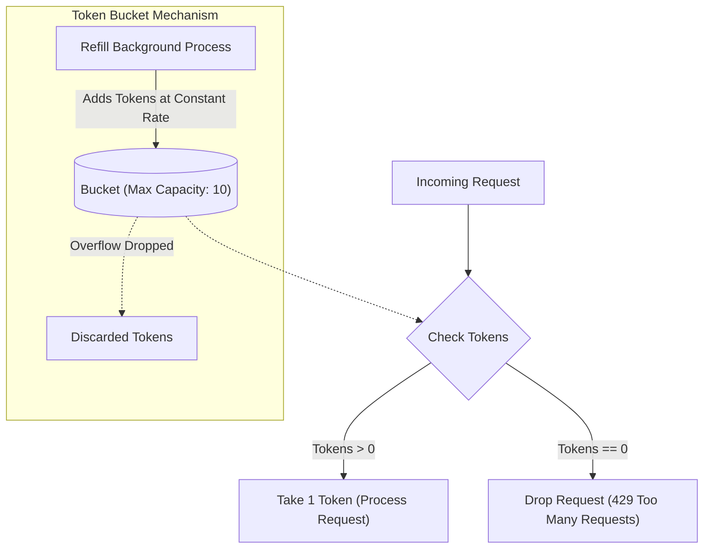
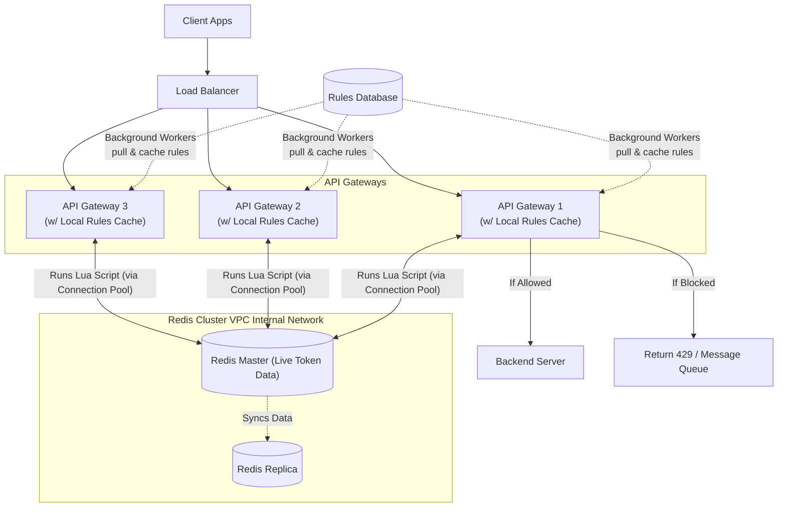

# Rate Limiter Design

## Requirements

Before diving into implementation, we must define what we are building.

### Functional Requirements

- Limit requests based on specific keys (per user, per IP, per API key, etc.).
- Support different tiers/plans (e.g., Free, Premium, Enterprise).
- Return an appropriate error message when the limit is exceeded.

### Non-Functional Requirements

- **Low Latency:** The rate limiter must add minimal overhead (<5ms) so it doesn't slow down the API.
- **High Availability:** It cannot be a single point of failure.
- **Horizontally Scalable:** It must scale easily as traffic increases.
- **Consistent:** Rate limiting must be strictly accurate across all gateway instances.

---

## 1. The "Why" (The Basics)

A rate limiter acts as a bouncer for your API. It restricts the number of requests a user (or IP address) can make within a specific time window.

If we don't have a rate limiter, our system is vulnerable to three major threats:

1. **Security (DoS Attacks):** A malicious script sending 100,000 requests/second will exhaust server CPU/Memory, crashing the application for everyone.
2. **Cost Control:** If your app consumes third-party services (e.g., Stripe, OpenAI, Twilio), you pay per API call. Without a limit, a runaway script or aggressive user could cost you thousands of dollars overnight.
3. **Fairness (The "Noisy Neighbor"):** A single aggressive user shouldn't be allowed to consume 90% of the server's bandwidth, degrading the experience for normal users.

---

## 2. The Evolution of Algorithms

When asked to build a rate limiter, we don't jump to the most complex solution. We start simple and identify the breaking points.

### Attempt 1: The Fixed Window Counter

- **How it works:** Divide time into fixed windows (e.g., 10:00 to 10:01). Keep a simple integer counter for that window. If the counter hits the limit (e.g., 10 requests), block further traffic until the clock rolls over to the next window.
- **The Fatal Flaw (The Boundary Problem):** A user can wait until 10:00:59, fire 10 requests, and then fire 10 more at 10:01:01. They successfully pushed 20 requests in 2 seconds, completely bypassing our intended "10 per minute" limit and potentially crashing the server with a spike.

### The Industry Standard: Token Bucket

To solve the boundary problem, companies like Stripe and Amazon use the Token Bucket.

- **The Concept:** Every user has a bucket with a maximum **Capacity** (e.g., 10 tokens). Tokens are dripped into the bucket at a constant **Refill Rate** (e.g., 2 per minute). Every API request costs 1 token.
- **Why it's brilliant:**
  - It completely eliminates the Boundary Problem because there are no clock "resets".
  - It allows for **Bursts**. A user returning after a long time has a full bucket and can burst out 10 rapid requests.
  - **Crucial Detail:** You cannot stockpile tokens indefinitely. If the bucket hits its capacity of 10, the refill rate tokens just overflow and vanish. The max burst is *always* capped by the Capacity.
  - **Lazy Refill (The Production Secret):** We do *not* run a background process that blindly adds tokens every second (that would require millions of background jobs). Instead, we calculate tokens *lazily* only when a request arrives: `elapsed_time * refill_rate`. We add those missing tokens right before processing the new request.

---

## 3. High-Level Architecture: Where does it live?

Where do we physically deploy this logic?

1. **Never the Client:** The front-end can be tampered with.
2. **Not the App Server:** If we put it in the Python/Node backend, millions of bad requests still reach the server. For example, if a botnet sends 100,000 requests a second, all 100,000 requests still reach your server. Even if your Python code immediately blocks them, your server still has to open the TCP connection, parse HTTP headers, and allocate heavy request objects in memory just to reject them. This overhead will crash your server.
3. **The Solution (API Gateway):** We place an API Gateway *in front* of the app servers.
   - **What is it?** An API Gateway (like Nginx, Kong, or Envoy) is just another server, but instead of running heavy business logic (like Python/Java), it runs highly optimized C/C++/Go code designed to do exactly one thing: manage network traffic ridiculously fast.
   - **Why it works:** It accepts network connections with almost zero memory overhead. It checks the limit and drops bad requests instantly. The backend servers never even see the spam, allowing them to focus entirely on serving good users without crashing.
   - *(Note on Load Balancers: To prevent a single API Gateway from being overwhelmed, we run multiple Gateways and place a **Load Balancer** in front of them. The Load Balancer blindly and evenly distributes incoming packets, while the Gateways do the intelligent "inspection" and rate limiting).*

### Where do we store the Token counts?

We need to read/write the token count on *every single request*.

- **Can we use a SQL Database (Postgres/MySQL)?** No. Databases write to a hard drive (disk). Disk operations are too slow. If you have thousands of requests a second, your database will become the bottleneck and crash.
- **Can we use Local RAM on the Gateway? (The Stateless vs. Stateful Problem):** If you only have one Gateway, yes. However, large companies **horizontally scale** by running multiple Gateway servers behind a load balancer. Gateways are designed to be **stateless**. If we store token counts in local memory, we make the Gateways **stateful**, leading to **state inconsistency**. For example, if Gateway 1 stores the token count in its local memory, Gateway 2 won't know about it. A user could get 10 tokens on Server 1 and 10 more on Server 2. Because they don't share state, this only enforces a **Local Rate Limit** per server, completely breaking our intended **Global Rate Limit**.
- **The Standard Solution: Redis (In-Memory Cache).** Redis acts as the centralized "source of truth". All Gateways ask a central Redis cluster for the token count. It stores all data in RAM (lightning-fast) and supports built-in auto-expiration (`TTL`/`EXPIRE`) for old records. *(Note: Even though it is an "in-memory" cache, Redis is a full physical/virtual server. It requires its own dedicated infrastructure provisioning including RAM, CPU, high network bandwidth, and persistent SSD storage to save backups in case of a crash!)*

#### But wait, isn't talking to Redis a slow network hop?

Yes, it is a network hop, but we mitigate the latency using two strategies:

1. **Connection Pooling:** The API Gateway does not open a brand new connection to Redis for every single user request. It opens a "pool" of persistent connections when it boots up and keeps them open, reusing them constantly.
2. **Internal Network:** The Redis instance and the API Gateway are placed in the exact same data center (often in the same VPC). The network hop between them is incredibly short, usually taking less than a single millisecond.

### The Rules Cache (Where do the limits come from?)

We know where the live *token counts* are stored (Redis), but how does the Gateway know what the actual limit is? For example, how does it know Free users get 10/min, but Premium users get 100/min?

#### Rate Limiting Keys

Before fetching rules, the Gateway must decide *who* is being limited. It extracts a key from the request, which can be:

- **User ID:** For logged-in users.
- **IP Address:** For unauthenticated traffic (to prevent spam).
- **API Key / OAuth Client:** For developer APIs (B2B).
- **Endpoint:** Different limits for `/login` (strict) vs `/feed` (lenient).

**Multi-level Limiting:** In production, a single request must pass *all* applicable rules simultaneously — e.g., per-endpoint + per-user + per-org. If any one rule triggers, the request is blocked.

1. **Rules Database:** A persistent database holds the business rules.
2. **Background Workers:** Worker processes constantly pull these rules from the slow database.
3. **Local Cache:** The workers push these rules into a blazing-fast cache often stored in the **Local RAM** of the Gateway server itself.

**Wait, didn't we just say Local RAM was bad?**

Local RAM is bad for storing *live token counts* because they change constantly and must be synchronized globally. However, Local RAM is **perfect** for storing *static rules* because rules rarely change, and it doesn't matter if Gateway 1 and Gateway 2 are out of sync for a few seconds when a rule is updated.

So the Gateway does two things:

1. Checks the **Local Cache** to see what the rule is (e.g., "Limit is 100").
2. Checks **Redis** to see the live count (e.g., "User has 5 remaining").

---

## 4. The Distributed Systems Nightmare

By using a central database like Redis, we solved the "Multiple Gateways" problem, but we introduced two new Distributed System problems:

### Problem 1: Redis is a Single Point of Failure

If we only have one Redis server and it crashes, the whole system goes offline. To fix this, big companies run multiple Redis servers linked together:

1. **Master-Replica (For High Availability):** You set up 1 Master and several Replicas. The Master handles all the "writes" (token updates) and instantly copies its data to the Replicas. If the Master dies, a Replica is automatically promoted to become the new Master.
2. **Sharding / Redis Cluster (For Massive Scale):** If you have a billion users, one Master cannot hold all the data. A Redis Cluster splits the data based on a rule. But how does the Gateway know *which* Redis node holds User A's tokens? It uses **Consistent Hashing**: `Hash(User ID) -> Node`. The Gateway hashes the key and instantly routes the request to the correct Redis node, ensuring consistency without needing a slow lookup table.

### Problem 2: Race Conditions

Let's say a user has 5 tokens left. They click a button twice at the exact same millisecond. Request A hits Gateway 1; Request B hits Gateway 2.

- Both Gateways read Redis at the same time: "Tokens = 5".
- Both subtract 1, and both write "4" back to Redis.
- We processed 2 requests, but the count only dropped by 1. The user got a free request!

- **The Bad Fix (Locks):** We could lock the Redis row while Gateway 1 updates it. But locks are incredibly slow and defeat the purpose of a fast rate limiter.
- **The Industry Fix (Lua Scripts):** We utilize Redis's ability to run **Lua Scripts**.
  - If we used traditional locks, the Gateway would have to make **multiple network trips**: Ask for lock -> Get lock -> Read tokens -> Do math -> Save tokens -> Release lock. This network latency causes massive traffic jams.
  - Instead, the Gateway hands a tiny Lua script to Redis. The script basically says: *"Lock yourself, do the math yourself, unlock yourself, and just tell me the final answer."*
  - Because Redis is **single-threaded**, it executes this Lua script **atomically**. When the script runs, Redis puts up a "Closed" sign. If Request B arrives, Redis forces it to wait in line until Request A's script is 100% finished. This eliminates the race condition natively inside Redis's memory with only **1 network hop**, requiring zero slow distributed locks.

### Problem 3: Failure Modes (What if Redis dies completely?)

If the entire Redis cluster goes offline, the Gateway cannot check token counts. What should it do?

- **Fail Open:** Allow all requests to pass through to the backend. (Use for: Social media feeds, read-heavy APIs where uptime is more critical than rate limiting).
- **Fail Closed:** Reject all requests with a `500 Internal Server Error`. (Use for: Payment gateways or resource-heavy write operations where an unlimited spike could corrupt data or bankrupt the company).

---

## 5. What happens to Rejected Requests?

When the Lua script says "No tokens left," what does the Gateway do? It depends on the architecture's needs:

### Option A: Drop it (Synchronous)

- **When to use:** For real-time, user-facing requests (e.g., refreshing a feed, loading a page).
- **Action:** Instantly drop the request and return an HTTP `429 Too Many Requests`. The client is waiting live at the screen; putting it in a queue to process 5 minutes later is useless to them.
- **HTTP Headers:** Production systems also include helpful headers so the client knows exactly what happened:
  - `X-RateLimit-Limit`: The total allowed requests in the window.
  - `X-RateLimit-Remaining`: How many they have left (0).
  - `X-RateLimit-Reset`: The exact timestamp when they will get more tokens.
  - `Retry-After`: A standard header telling the client how many seconds to wait before trying again.
- **Client-side Backoff:** A well-behaved client should use **exponential backoff** — wait, retry, wait 2×, retry, wait 4× — instead of hammering the server the moment the window resets.

### Option B: Message Queues (Asynchronous)

- **When to use:** For background tasks, webhooks, or critical data that cannot be lost (e.g., Stripe payment confirmations, bulk email sends).
- **Action:** The Gateway returns an HTTP `202 Accepted` (meaning "I received this, but haven't worked on it yet"). It then pushes the request into a **Message Queue** (like Kafka or RabbitMQ).
- **The Benefit (Load Leveling):** Worker servers pull from this queue at a safe, steady pace. This acts as a shock absorber, smoothing out massive traffic spikes without losing any critical data.

---

## 6. Alternative Algorithms

While the **Token Bucket** is the most widely adopted algorithm (used by Amazon, Stripe, etc.), a complete systems design overview should acknowledge other approaches used for specific edge cases:

1. **Leaking Bucket:** Similar to the Token Bucket, but instead of allowing a sudden "burst" of requests, it forces all traffic to be processed at a perfectly constant, steady drip. (Conceptually, this is identical to placing requests in a Message Queue and processing them with background workers at a fixed rate).
2. **Sliding Window Counter:** A hybrid mathematical approach. It solves the "Boundary Problem" of the Fixed Window algorithm without needing the complex token refill logic of the Token Bucket. It tracks the request count in the *previous* minute and estimates the current traffic based on a weighted overlap.
3. **Sliding Window Log:** The most accurate algorithm possible. It keeps a precise timestamp log of *every single request* a user makes. It is perfectly accurate but is rarely used in high-scale production because storing exact timestamps for millions of requests is too memory-intensive.

---

## 7. Monitoring & Observability

A production rate limiter is invisible until something goes wrong. At minimum, track:

- **Block rate:** A sudden spike in 429s could mean a bug or an attack — not always a legitimate traffic surge.
- **Token exhaustion per tier:** Identifies which user segments hit limits most, informing plan/limit adjustments.
- **Redis latency alerts:** If Redis response time exceeds the <5ms NFR, page on-call — the whole system degrades silently.