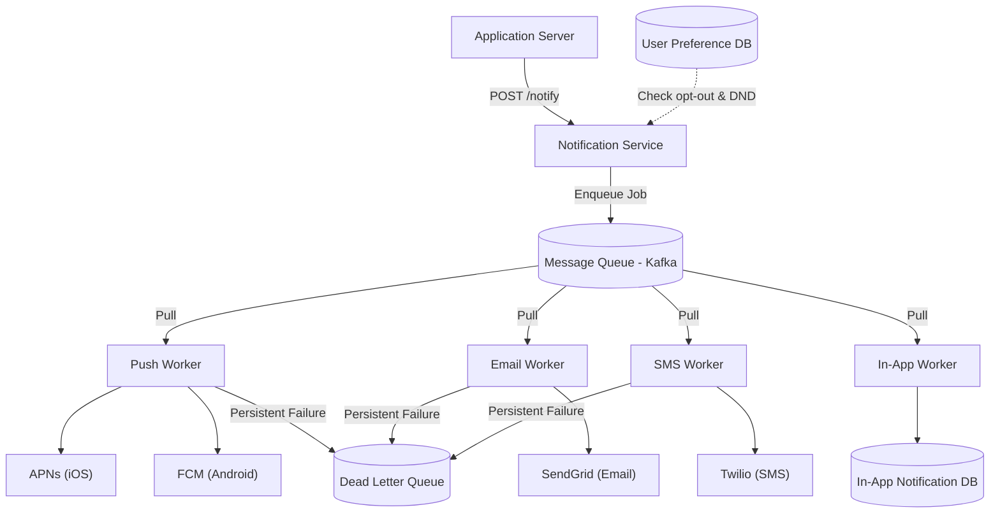

# Notification System Design

## Requirements

Before diving into implementation, we must define what we are building.

### Functional Requirements

- Send notifications via multiple channels: Push (mobile), Email, SMS, and In-App.
- Respect user preferences — users can opt out of specific channels or notification types.
- Support different notification types: transactional (OTP, payment confirmation) vs. marketing (promotions).
- Guarantee delivery — critical notifications (OTPs, alerts) must not be lost.

### Non-Functional Requirements

- **Low Latency:** Transactional notifications (OTPs) must be delivered within seconds.
- **High Availability:** The system cannot go down — a missed OTP means the user can't log in.
- **Horizontally Scalable:** Must handle millions of notifications per day without degradation.
- **Fault Tolerant:** If one channel provider (e.g., Twilio) goes down, the system shouldn't fail entirely.

---

## 1. The "Why" (Why Not Just Call SendGrid Directly?)

The naive approach is to call `send_email()` directly inside your application code. This seems simple, but it introduces three fatal problems:

1. **Tight Coupling (The Cascade Failure):** If SendGrid is down, your entire checkout flow fails. A user can't complete a payment just because an email couldn't send. Two completely unrelated systems have been chained together.

2. **Traffic Spikes (The Thundering Herd):** A flash sale at 12:00 triggers 2 million emails simultaneously. Your app server dies trying to open 2 million HTTP connections to SendGrid at once. The app crashes, not because of bad business logic, but because of a notification.

3. **Third-Party Rate Limits:** Email and SMS providers enforce their own rate limits. Without a buffer, your app will slam into those limits and start dropping notifications silently with no retry logic.

The solution is to treat notifications as a separate concern entirely — a dedicated, asynchronous service.

---

## 2. The Channels

Before building anything, we need to understand the delivery endpoints:

- **Push Notifications:** Mobile alerts delivered via:
  - **APNs** (Apple Push Notification service) for iOS devices.
  - **FCM** (Firebase Cloud Messaging) for Android devices.
  - Requires the user's **device token**, which changes every time they reinstall the app.

- **Email:** Delivered via providers like SendGrid, AWS SES, or Mailgun. Best for rich content (receipts, newsletters). The slowest channel.

- **SMS:** Delivered via Twilio or AWS SNS. Highest open rate (~98%). Most expensive per message. Reserved for OTPs and critical alerts.

- **In-App Notifications:** Stored in a database (e.g., Postgres), fetched and rendered when the user opens the app. No third-party dependency — the most reliable channel.

---

## 3. High-Level Architecture

### The Naive Approach (And Why It Fails)

The app server calls SendGrid directly. Under a traffic spike, the app server is blocked waiting for HTTP responses from SendGrid. When SendGrid is slow, your app is slow. They are now the same system.

### The Production Approach: Decouple with a Message Queue

The key architectural insight is to **separate the act of requesting a notification from the act of sending it.**

1. **Notification Service:** A dedicated microservice that receives a notification request (who, what, which channel). It validates the request and immediately puts it into a queue. It does not call any third-party API.

2. **Message Queue (Kafka / RabbitMQ):** The buffer between the Notification Service and the actual senders. The Notification Service returns `202 Accepted` to the caller instantly.

3. **Channel Workers:** Separate worker processes that pull jobs from the queue and call the actual third-party providers at a controlled, steady rate.

4. **Third-Party Providers:** APNs, FCM, SendGrid, Twilio — the actual last-mile delivery.

**Why is the queue the critical piece?** It acts as a **shock absorber**. If 2 million email jobs arrive in 1 second, the queue absorbs the entire spike. Workers drain it at a safe, steady pace. The application server never stalls, and SendGrid is never overwhelmed.

---

## 4. The Delivery Guarantee Problem

This is the hardest conceptual challenge. When we say "send a notification," what guarantee do we make?

There are three delivery semantics in distributed systems:

1. **At-most-once:** Fire and forget. Fast, but messages can be lost. *(Use for: low-priority marketing emails.)*
2. **At-least-once:** Retry until the provider acknowledges success. Messages may be delivered more than once. *(Use for: the majority of cases.)*
3. **Exactly-once:** Delivered precisely once. Theoretically ideal, but extremely hard to achieve across distributed systems and usually overkill.

### The Duplicate Problem (And Why It Happens)

At-least-once delivery sounds great until you realize it causes duplicates. Here's the exact scenario:

- Worker calls SendGrid. SendGrid sends the email successfully.
- The network drops before SendGrid's `200 OK` reaches the worker.
- Worker thinks the call failed. It retries. SendGrid sends the email *again*.
- The user receives 2 OTPs for the same login.

### The Fix: Idempotency Keys

Assign every notification request a unique `notification_id` (a UUID). Before the worker calls any provider, it checks a Redis set: *"Have I already processed `notif-abc-123`?"*

- **If yes:** Skip. The notification was already sent. Return success silently.
- **If no:** Send the notification. Add `notif-abc-123` to the Redis set with a TTL (e.g., 24 hours).

This makes retries completely safe. The worker can retry 10 times and the user will only ever receive one notification.

---

## 5. The Distributed Problems

### Problem 1: Retries & Exponential Backoff

If Twilio is temporarily down, workers must not hammer it with immediate retries — this will make the outage worse and cause the queue to back up. The industry standard is **exponential backoff with jitter**:

- Retry 1: wait 1s → Retry 2: wait 2s → Retry 3: wait 4s → Retry 4: wait 8s...

After N failed retries, the message is moved to a **Dead Letter Queue (DLQ)** — a separate, isolated queue for persistently failed messages. On-call engineers can inspect, debug, and replay them once the underlying issue is resolved. Without a DLQ, failed messages are simply lost forever.

### Problem 2: Third-Party Provider Failure

If APNs (Apple's push service) goes down, every iOS push notification fails. Production systems handle this with **fallback routing**:

- APNs down → retry via SMS for *critical* notifications (e.g., 2FA codes).
- For *non-critical* notifications (e.g., "liked your post"): log the failure, alert on-call, and replay the DLQ when APNs recovers. There is no point sending a "like" alert 3 hours late.

### Problem 3: Stale Device Tokens (Push-Specific)

APNs and FCM device tokens expire when a user reinstalls the app or revokes push permissions. Sending to a stale token wastes API quota and slows down the worker.

The fix: When APNs returns a `410 Gone` response, the worker **must** immediately delete that device token from the user's record in the database. This is not optional — failing to do this will cause your system to accumulate thousands of dead tokens over time, inflating costs and degrading performance.

---

## 6. User Preferences & Throttling

A notification system without user preference management is just a spam engine.

### Preference Service

Before any worker sends a notification, it checks the **User Preference Service**:

- Is this user opted out of this channel entirely?
- Is this user in a **Do Not Disturb** window (e.g., 10pm–8am in their local timezone)?
- Is this notification *type* (marketing) disabled by this user?

If any check fails, the worker drops the job silently — the notification is not sent and not retried.

**Wait, doesn't this check add latency?** The Preference Service stores its data in Redis (not a slow SQL database). The lookup is sub-millisecond and does not meaningfully impact end-to-end delivery time.

### Notification Rate Limiting

The notification system itself needs rate limiting. Consider a social app: if someone gets 200 "likes" in 10 minutes, sending 200 separate push notifications is annoying and burns battery on the user's device.

Production systems use **batching and digesting**:

- Track per-user notification counts in Redis.
- If a user exceeds a threshold (e.g., 5 "likes" notifications in 5 minutes), hold subsequent ones.
- Send a single digest: *"You have 47 new likes"* instead of 47 individual notifications.

---

## 7. Failure Modes

| Scenario | Response |
|---|---|
| 3rd party provider (SendGrid) down | Retry with exponential backoff → move to DLQ after N failures |
| Message Queue down | Notification Service falls back to synchronous send, degrading gracefully |
| Preference Service down | Fail open — send the notification (better to over-notify than miss a critical OTP) |
| Stale device token | Delete token from DB immediately on `410 Gone` from APNs / FCM |
| DLQ growing rapidly | Page on-call — signals a systematic failure requiring human intervention |

---

## 8. Monitoring & Observability

Track per channel at minimum:

- **Delivery rate:** Percentage of notifications successfully delivered. A sudden drop signals a provider outage before your users start complaining.
- **Bounce rate:** Invalid emails or stale device tokens. A rising bounce rate means dirty user data that needs cleanup.
- **DLQ size:** A growing DLQ is a red alert — something is systematically failing. Set an alert if DLQ depth exceeds a threshold.
- **End-to-end latency:** Time from `POST /notify` to confirmed delivery. Critical for OTP SLAs — if an OTP takes 30 seconds to arrive, users will abandon the flow.