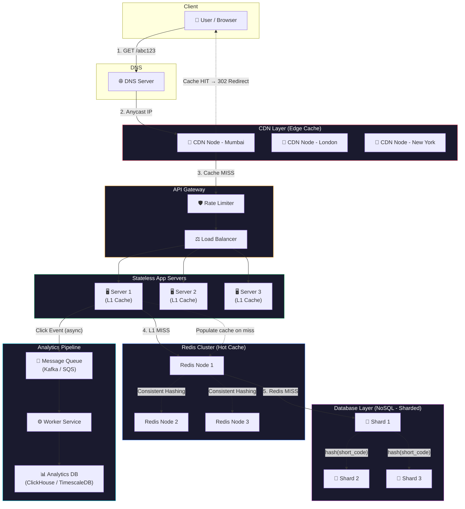

# URL Shortener — System Design (Detailed Notes)

> **⚠️ Disclaimer:** These notes are being prepared in my current learning phase while studying system design concepts. If you spot any mistakes or have suggestions for improvement, feedback is always welcome!

---

## High-Level Architecture Diagram



**How to read this diagram:**

| Path | Flow | Purpose |
|------|------|---------|
| **Read (Redirect)** | User → DNS → CDN → API Gateway → App Server (L1) → Redis → DB | Serve redirects with multi-level caching |
| **Write (Shorten)** | User → API Gateway → App Server → DB (+ populate Redis) | Create new short URL mappings |
| **Analytics** | App Server → Message Queue → Worker → Analytics DB | Async click tracking without slowing redirects |

## Core Requirements

### Functional Requirements

A URL shortener service must support the following core functionalities:

- **Shorten a URL**: Given a long URL, the system should generate a unique, short alias (e.g., `https://xyz.ly/abc123`) that maps to the original. This is the primary write operation.
- **Redirect to the original URL**: When a user visits the short URL, the system should look up the mapping and redirect the user's browser to the original long URL with minimal latency.
- **Analytics (Optional)**: Track click counts, geographic distribution, referrer data, and device information. This data powers dashboards for users who want to understand how their links are performing.

### Non-Functional Requirements

- **Read-heavy traffic**: URL shorteners are heavily read-biased. For every URL that gets created, it may be clicked hundreds or thousands of times. This means the system architecture should be optimized primarily for fast reads.
- **Low latency for redirects**: Redirects must be near-instant. Users clicking a short link expect to land on the destination page within milliseconds. Any delay here directly impacts user experience.
- **High availability**: The system should be available 24/7 with minimal downtime. If the shortener goes down, every short link it has ever generated becomes unusable, which can break links across the entire internet (emails, social media posts, printed materials, etc.).

---

## Constraints & Assumptions

Before diving into the design, it helps to define the scale we're designing for:

1. **Target scale**: We aim to support ~100 million short URLs in total, with approximately 1 billion redirect requests per day. This gives us roughly ~11,500 redirects per second on average, with peak traffic potentially 2–3× higher.
2. **Read/Write ratio**: The ratio of redirects (reads) to new URL creations (writes) is approximately 100:1. This heavily read-skewed ratio drives many of our architectural decisions — caching becomes critical, while write throughput requirements are comparatively modest.
3. **Short code length**: Each short URL uses a 6–8 character alphanumeric code. With Base62 encoding (A-Z, a-z, 0-9), a 7-character code gives us 62⁷ ≈ 3.5 trillion possible combinations — far more than the 100M URLs we need. This ensures we won't run out of codes.

---

## APIs

The service exposes three main API endpoints:

### 1. Create Short URL

```http
POST /shorten
```

The client sends a long URL in the request body, and the server returns a newly generated short URL.

**Request:**

```json
{
  "long_url": "https://example.com/very/long/path/to/some/resource"
}
```

**Response:**

```json
{
  "short_url": "https://xyz.ly/abc123"
}
```

Internally, the server generates a unique short code, stores the mapping (`abc123 → long_url`) in the database, and returns the full short URL to the client.

### 2. Redirect

```http
GET /{code}
```

When a user visits `https://xyz.ly/abc123`, the server looks up `abc123` in the database (or cache), finds the corresponding long URL, and returns an **HTTP 302 (Found)** redirect response. The browser then automatically navigates to the original URL.

> **Why 302 and not 301?** A 301 (Permanent Redirect) tells the browser to cache the redirect forever and never ask the server again. This is problematic because: (a) we lose the ability to track click analytics, and (b) if the user updates the destination URL, browsers with cached 301s will never see the change. A 302 (Temporary Redirect) ensures every click goes through our server, enabling analytics and allowing URL updates.

> [!NOTE]
> **Caveat:** Some URL shorteners intentionally use 301 for SEO purposes — when the short URL is meant as a permanent canonical link and analytics aren't needed. The choice between 301 and 302 depends on your use case. For analytics-focused shorteners (like Bitly), 302 (or even 307) is the right call.

### 3. Analytics / Metadata

```http
GET /info/{code}
```

This endpoint returns metadata about a short URL — including the original long URL, creation timestamp, expiration date (if any), and click statistics (total clicks, clicks over time, geographic breakdown, etc.). This powers user-facing dashboards.

---

## Data Model

### Why NoSQL?

For a URL shortener, the primary data access pattern is extremely simple: given a short code, look up the corresponding long URL. This is a classic **key-value lookup** pattern, which makes NoSQL databases (like DynamoDB, Cassandra, or Redis) an excellent fit:

- **Horizontal scaling**: NoSQL databases are designed to scale out by adding more nodes. As our URL database grows, we can add more shards without complex schema migrations.
- **Simple access pattern**: We're essentially doing `GET(short_code) → long_url`. We don't need complex joins, transactions, or relational queries. A key-value store gives us O(1) lookup performance.
- **High throughput**: NoSQL databases handle massive read throughput efficiently, which aligns perfectly with our read-heavy workload.

> [!NOTE]
> **Caveat:** NoSQL isn't the only viable option here. **SQL databases (like MySQL or PostgreSQL) work perfectly fine** for a URL shortener — Bitly historically used MySQL. A well-indexed SQL table with `short_code` as the primary key handles 100M rows with ease. NoSQL shines at extreme scale and when you want built-in horizontal sharding, but don't dismiss SQL outright in an interview. It's a valid trade-off discussion.

**Schema (simplified):**

```text
short_code (PK) → {
    long_url: "https://example.com/...",
    created_at: timestamp,
    expires_at: timestamp (optional),
    user_id: string (optional)
}
```

---

# Read Path & Caching

## Redirect Flow

The redirect path is the most performance-critical part of the system, since it handles the bulk of traffic. Here's how a redirect request flows through the system:

```text
User clicks short URL
        ↓
    GET /{code}
        ↓
  ┌─────────────────┐
  │  CDN / Edge Cache │  ← Check CDN first (closest to user)
  └────────┬────────┘
           │ HIT → Return 302 redirect immediately
           │ MISS ↓
  ┌─────────────────┐
  │   API Server     │  ← Request reaches our backend
  └────────┬────────┘
           ↓
  ┌─────────────────┐
  │     Redis        │  ← Check in-memory cache
  └────────┬────────┘
           │ HIT → Return 302 redirect
           │ MISS ↓
  ┌─────────────────┐
  │    Database      │  ← Final source of truth
  └────────┬────────┘
           ↓
   Populate Redis cache
           ↓
   Return 302 redirect
```

At each layer, if we find the mapping, we short-circuit and return immediately. This multi-layer approach ensures that the vast majority of requests are served from cache, never touching the database.

---

## Caching Strategy

### CDN (Content Delivery Network)

The **CDN sits closest to the user** — at the edge of the internet, in data centers distributed worldwide. When a redirect response is cached at the CDN, the user gets redirected without the request ever reaching our servers.

- We set a **TTL (Time To Live)** on cached responses using the `Cache-Control: s-maxage=300` header (e.g., 5 minutes).
- After TTL expires, the CDN will re-fetch from our origin server.
- This dramatically reduces load on our backend and provides the lowest possible latency.

> [!NOTE]
> **Caveat:** Most CDNs **do not cache 302 responses by default**. You must explicitly configure the `Cache-Control` headers (like `s-maxage`) on your origin server's 302 response for CDN caching to work. Without this, every request will pass through to the origin, defeating the purpose of the CDN. This is a common gotcha in real-world implementations.

### Redis (In-Memory Cache)

Behind the CDN, we use **Redis as a hot cache** within our backend infrastructure. Redis stores frequently accessed `short_code → long_url` mappings in memory, providing sub-millisecond lookup times.

- Redis sits between the API server and the database, intercepting most read requests before they hit the DB.
- We use Redis clusters for high availability and larger memory capacity.

### Cache Invalidation

Cache invalidation follows a **TTL-based strategy**: cached entries automatically expire after a set duration. When a user updates their redirect target (changes where a short URL points), the old cached entry will naturally expire within the TTL window. For immediate invalidation, we can explicitly delete the key from Redis and purge the CDN cache.

---

# Scalability

## Stateless App Servers

A fundamental design principle is that **all application servers must be stateless** — meaning they don't store any session data, user state, or cached information that can't be recreated. Every request contains all the information needed to process it.

Why this matters:

- **Horizontal scaling becomes trivial**: Since no server holds unique state, we can add or remove servers freely. A load balancer distributes incoming requests across available servers, and any server can handle any request.
- **Failure resilience**: If a server crashes, no data is lost. The load balancer simply routes traffic to the remaining healthy servers.
- **No sticky sessions needed**: Users don't need to be routed to the same server on subsequent requests, which simplifies load balancing.

```text
              ┌──────────────┐
              │ Load Balancer │
              └──────┬───────┘
         ┌───────────┼───────────┐
         ↓           ↓           ↓
   ┌──────────┐ ┌──────────┐ ┌──────────┐
   │ Server 1 │ │ Server 2 │ │ Server 3 │
   └──────────┘ └──────────┘ └──────────┘
```

Each server is identical and interchangeable. We can auto-scale based on CPU/memory usage or request rate.

## Database Sharding

As the database grows to hundreds of millions of records, a single database instance won't be able to handle the load. **Sharding** splits the data across multiple database instances (shards), each holding a subset of the data.

**Shard key selection:** We use `hash(short_code) % num_shards` to determine which shard stores a given URL mapping. This provides:

- **Even data distribution**: Hash functions spread data uniformly across shards, preventing any single shard from becoming disproportionately large.
- **Predictable routing**: Given a short code, we can instantly determine which shard to query without broadcasting the request to all shards.
- **Linear scalability**: Adding more shards increases both storage capacity and read/write throughput proportionally.

---

# Redis Caching (Deep Dive)

## Why is Caching Essential?

Even with database sharding, directly hitting the database for every redirect is unsustainable at scale. Consider our target of 1 billion redirects/day (~11,500/sec):

- **Without cache**: Every single redirect would require a database read. This means 11,500 queries/second hitting our database shards, causing high latency, potential shard overload, and degraded performance during traffic spikes.
- **With Redis cache**: The vast majority of lookups are served from Redis (sub-millisecond response time), and only cache misses trickle down to the database — perhaps 1–5% of total traffic.

Redis stores the simple mapping `short_code → long_url` in memory, providing O(1) lookups with sub-millisecond latency.

## Redis Cluster

A single Redis node has limited memory (typically 25–100 GB). To handle our data volume and provide high availability, we deploy **Redis in cluster mode**:

- **Data is sharded** across multiple Redis nodes, each responsible for a range of hash slots.
- **Replication** ensures that if a primary node fails, a replica takes over automatically.
- **Higher aggregate memory**: With N nodes, we have N× the memory capacity of a single node.

## Consistent Hashing

To distribute keys across Redis cluster nodes, we use **consistent hashing**. Unlike simple modular hashing (`hash(key) % N`), consistent hashing provides a critical advantage:

- **Minimal key redistribution**: When a node is added or removed, only ~1/N of the keys need to move to a different node. With modular hashing, nearly all keys would need to be remapped.
- **Smooth scaling**: We can scale the Redis cluster up or down without causing a massive "cache miss storm" that would temporarily overload the database.
- **Even distribution**: Virtual nodes ensure that keys are distributed uniformly, preventing hotspots.

---

# CDN (Deep Dive)

## What is a CDN?

A CDN (Content Delivery Network) is essentially an **internet-scale edge cache**. CDN providers (like Cloudflare, CloudFront, Akamai) operate thousands of data centers worldwide, each caching content close to end users.

**Key difference from Redis:**

| Property | CDN | Redis |
|----------|-----|-------|
| Location | Edge (close to user) | Backend (inside our infra) |
| Latency | ~1-20ms (geographic proximity) | ~1-5ms (network hop within data center) |
| Purpose | Reduce load on origin servers | Reduce load on database |
| Scope | Public, user-facing responses | Internal, backend lookups |

When the CDN caches a redirect response, it stores the full HTTP response:

```http
HTTP/1.1 302 Found
Location: https://destination-url.com/original-page
Cache-Control: s-maxage=300
```

The `s-maxage=300` header tells the CDN to cache this response for 300 seconds (5 minutes). During this window, all users in that CDN region get redirected without any request reaching our servers.

## CDN Request Flow (Step by Step)

Here's the complete journey of a redirect request:

1. **User clicks the short URL** (e.g., `https://xyz.ly/abc123`).
2. **Browser performs DNS lookup** for `xyz.ly`.
3. **DNS returns a CDN Anycast IP** — but how does the CDN decide which data center is "nearest"? This is where **Anycast BGP routing** comes in:

   - The CDN provider assigns the **same IP address** to all of its edge servers worldwide. For example, every CDN node in Mumbai, Singapore, London, and New York all advertise the same IP (say `104.26.10.5`).
   - Each CDN node announces this IP to the internet via **BGP (Border Gateway Protocol)** — the routing protocol that internet routers use to decide where to send traffic.
   - When a user's request leaves their ISP, the internet's BGP routers automatically route it to the **topologically closest** CDN node — meaning the one with the fewest network hops, not necessarily the geographically closest (though they usually correlate).
   - This happens entirely at the **network layer** — no application logic needed. The internet's routing infrastructure does the work for us.

   ```text
   User (Mumbai) ──→ ISP ──→ BGP routes to ──→ CDN Mumbai  ✅ (2 hops)
                                            ╳── CDN London  ❌ (8 hops)
                                            ╳── CDN New York ❌ (10 hops)
   ```

   This is why CDN latency is so low — the user's request never travels across continents. It hits the nearest edge node within a few milliseconds.

4. **The nearest CDN edge node** receives the request (e.g., a user in Mumbai hits the Mumbai CDN node).
5. **CDN cache lookup** for the URL `/{code}`:

   - **Cache HIT**: The CDN immediately returns the cached 302 redirect. The user is redirected within milliseconds, and our origin servers are never contacted. ✅
   - **Cache MISS**: The CDN forwards the request to our origin server (API Server). The origin checks Redis, then the database if needed. The response flows back through the CDN, which **caches it** (using the TTL from the `Cache-Control` header) before returning it to the user. Subsequent requests from the same region will be served from the CDN cache.

---

# Queue & Analytics

## The Dual Responsibility Problem

When a user clicks a short link, the system has two jobs to do:

1. **Redirect the user** to the destination URL — this must happen **immediately** (within milliseconds).
2. **Record the click** for analytics — this involves writing data (timestamp, IP, user-agent, geo-location, referrer, etc.) to a database.

If we try to do both synchronously (redirect + write analytics in the same request), the analytics write adds latency to the redirect. This violates our low-latency requirement. The solution is **asynchronous processing**.

## Decoupling with a Message Queue

Instead of writing analytics data directly to the database during the redirect, we **push a click event into a message queue** (e.g., Kafka, RabbitMQ, SQS):

```text
  User clicks short URL
          ↓
    API Server handles redirect
    ├── Returns 302 immediately to user ✅
    └── Pushes click event to Queue (async) ✅
          ↓
    Worker Service (background)
    ├── Consumes events in batches
    ├── Aggregates data
    └── Writes to Analytics DB
```

**Benefits:**

- **Redirect remains ultra-fast**: The API server's only blocking operation is the redirect lookup (served from cache). The analytics event is fire-and-forget.
- **Batch processing**: Workers consume events in batches (e.g., every 10 seconds or every 1000 events), which is far more efficient than individual writes.
- **Fault tolerance**: If the analytics database is temporarily down, events accumulate in the queue and are processed once it recovers. No click data is lost.

---

# Analytics & Rate Limiting

## Goal

We need to count clicks efficiently without overwhelming the database. At 1 billion clicks/day, doing a database write per click would require ~11,500 writes/second — expensive and unnecessary for approximate analytics.

## Approach

### 1. In-Memory Counters (Redis)

Instead of writing to the database on every click, we **increment a counter in Redis**:

```text
INCR clicks:abc123           → Total clicks for code abc123
INCR clicks:abc123:2026-07-11 → Clicks for today
```

Redis `INCR` is atomic and extremely fast (sub-millisecond, typically a few microseconds). This handles burst traffic without any performance concerns.

### 2. TTL Windows for Time-Based Aggregation

We create separate counters with TTLs for different time granularities:

- `clicks:abc123:minute:202607111530` (TTL: 1 hour) — per-minute granularity, auto-expires after 1 hour
- `clicks:abc123:hour:2026071115` (TTL: 7 days) — per-hour granularity, auto-expires after 7 days

This gives us time-series analytics (clicks over time) without accumulating stale data.

### 3. Periodic Batch Flush

A background worker periodically (e.g., every 60 seconds):

1. Reads the accumulated counters from Redis.
2. Aggregates them into summary records.
3. Writes the aggregated data to the analytics database in a single batch operation.
4. Deletes the processed counters from Redis.

This converts thousands of individual increments into a single bulk database write, reducing DB load by orders of magnitude.

> [!NOTE]
> **Caveat:** The notes mention a generic "analytics DB" — in practice, consider using purpose-built databases for time-series analytics data. Options include **ClickHouse** (column-oriented, great for aggregation queries), **TimescaleDB** (PostgreSQL extension for time-series), or a **Kafka → OLAP pipeline** (for real-time streaming analytics at massive scale). The choice depends on query patterns and scale requirements.

---

# Rate Limiting

## Why Rate Limiting?

Without rate limiting, a single user or bot could overwhelm the system with millions of requests — either creating short URLs at an abusive rate or clicking links to inflate analytics. Rate limiting protects the system from abuse and ensures fair usage.

## Implementation

Rate limiting is placed at the **API Gateway** layer — the entry point before requests reach the application servers. This ensures abusive traffic is blocked early, before consuming backend resources.

**Common algorithms:**

| Algorithm | How it works | Best for |
|-----------|-------------|----------|
| **Fixed Window** | Counts requests per fixed time window (e.g., 100 req/min). Resets at window boundary. | Simple implementation |
| **Sliding Window** | Uses a sliding time window for smoother rate enforcement. Prevents burst at window boundaries. | Smoother limiting |
| **Token Bucket** | Tokens are added at a fixed rate. Each request consumes a token. Allows short bursts up to bucket capacity. | Allowing controlled bursts |

**Granularity options:**

- **Per API key**: Each registered API user gets their own rate limit.
- **Per user/IP**: Limits individual users to prevent abuse.
- **Per short code**: Limits clicks on a specific short URL (useful for preventing DDoS on a single link).

---

# Bottlenecks & Trade-offs

## Heavy Analytics Writes

**Problem:** Even with batching, the analytics database can become a bottleneck if many short URLs are receiving heavy traffic simultaneously. Batch flushes from hundreds of worker instances can create write spikes.

**Solutions:**

- **Redis counters with batch flush**: As discussed above — aggregate in Redis, flush periodically. This converts millions of individual writes into thousands of batch writes.
- **Write-optimized databases**: Use time-series databases (like InfluxDB or TimescaleDB) for analytics data, which are designed for high-volume append operations.
- **Database sharding**: Shard the analytics database by short code or time range to distribute write load.

## Hot Key Problem

**Scenario:** A single short URL goes viral — imagine a celebrity tweets a link that gets 10 million clicks in an hour. This concentrates massive traffic on a single key.

**Impact:**

- The **CDN cache** for that key gets hammered in all regions.
- The specific **Redis node** holding that key receives disproportionate traffic.
- The specific **database shard** for that key may become overloaded.

**Mitigation strategies:**

- **CDN caching**: Absorbs most of the traffic at the edge (this is exactly what CDNs are built for).
- **Redis key replication**: Replicate hot keys across multiple Redis nodes, reading from any replica.
- **Local (L1) caching**: Each app server caches the hot key locally, avoiding even the Redis network hop.

## CDN Challenges

CDNs are powerful but introduce their own trade-offs:

- **Stale cache**: If a user updates their redirect target, CDN nodes worldwide may still serve the old destination until the cache TTL expires. We can't use very long TTLs without accepting this staleness window.
- **Cold regions**: CDN nodes in less-popular regions may not have the redirect cached, resulting in cache misses that hit our origin server. These misses can cluster together (e.g., when a link is first shared in a new geography).
- **CDN bypass attacks**: Sophisticated attackers can bypass the CDN (by directly hitting origin IPs) to overload backend servers. Mitigation includes hiding origin IPs and using CDN-only access controls.

---

# Handling CDN Misses

## L1 Cache (Local In-Memory Cache)

Even after the CDN, there's another caching layer we can add: a **local in-memory cache (L1 cache)** inside each application server process.

When a request misses the CDN and reaches an app server, the server first checks its own local memory before making a network call to Redis:

```text
short_code → long_url  (stored in process memory, e.g., a HashMap / LRU cache)
```

**Benefits:**

- **Zero network latency**: No network hop — the lookup is a simple in-memory hash table access (~nanoseconds).
- **Reduces Redis load**: Prevents Redis from becoming a bottleneck during traffic spikes.
- **Extremely cheap**: Only costs a small amount of RAM on each server.

> [!NOTE]
> **Caveat:** L1 cache introduces a **consistency trade-off**. Since each app server maintains its own independent local cache, different servers may hold different versions of the same mapping. If a user updates their redirect target, some servers will still serve the old URL until their local TTL expires. During this window, users may experience inconsistent redirects depending on which server handles their request. This is usually acceptable for URL shorteners (eventual consistency is fine), but it's worth mentioning in an interview.

## Multi-Level Cache Architecture

The complete caching hierarchy, from fastest to slowest:

```text
┌─────────────────────────────────┐
│         CDN (Edge)              │  ← Closest to user, ~1-20ms
├─────────────────────────────────┤
│    L1 Cache (Local Memory)      │  ← Inside app server, ~nanoseconds
├─────────────────────────────────┤
│        Redis Cluster            │  ← Backend cache, ~1-5ms
├─────────────────────────────────┤
│        Database (NoSQL)         │  ← Source of truth, ~5-50ms
└─────────────────────────────────┘
```

**Request flow through the cache layers:**

1. **CDN Hit** → Return redirect instantly. Done. ✅
2. **CDN Miss** → Request reaches app server.
3. **L1 Cache Hit** → Return redirect from local memory. Done. ✅
4. **L1 Cache Miss** → Query Redis.
5. **Redis Hit** → Return redirect. Populate L1 cache. Done. ✅
6. **Redis Miss** → Query Database.
7. **DB Hit** → Return redirect. Populate both Redis and L1 cache. Done. ✅

In practice, with this multi-level caching strategy, **99.9%+ of all redirect traffic is reads**, and most of those reads are served from CDN or L1 cache. Only a tiny fraction of requests ever reach the database.

---

# Why L1 Cache Specifically?

The L1 cache might seem redundant when we already have Redis, but it provides unique advantages:

- **No network hop**: Redis still requires a network round-trip (~1-5ms). L1 cache eliminates this entirely.
- **Prevents Redis from being a single point of bottleneck**: During massive traffic spikes, thousands of app server instances all querying Redis simultaneously can overwhelm even a Redis cluster. L1 absorbs the majority of this load.
- **No write bottleneck**: L1 is read-only from the application's perspective (populated on cache misses). There's no replication, no synchronization between servers — each server maintains its own independent local cache.
- **No queue required**: Unlike distributed caches that may need consistency protocols, L1 is purely local. Stale entries simply expire via TTL.
- **Prevents thundering herd effect**: If a CDN cache expires for a popular URL, hundreds of requests might simultaneously flood the backend. With L1 cache, each server only sends one request to Redis (on its own L1 miss), dramatically reducing the "herd" size.
- **Negligible cost**: L1 cache only uses CPU for hash lookups and a small amount of server RAM. The operational cost is essentially zero.

---

# Summary

The URL shortener architecture is designed around a simple principle: **optimize aggressively for reads**. With a 100:1 read/write ratio and billions of daily redirects, the system relies on multiple caching layers (CDN → L1 → Redis → DB), stateless horizontal scaling, and asynchronous analytics processing to deliver sub-millisecond redirects at massive scale.